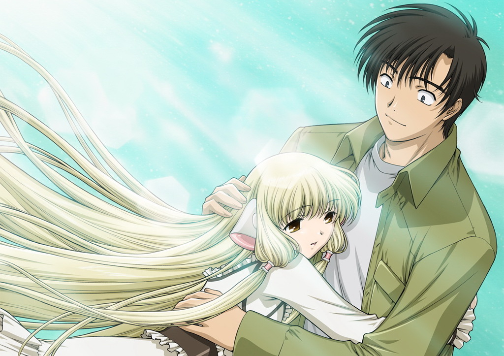

In 2013 when I just became an exec in anime@UTS, Anthony and I started this "game" where every day we would post 1 question on the club FB group and all the new and existing members would reply to. These questions ranged from favourite anime characters, to most hated moments, but were always related to anime. We called it 100 days of anime. Now, almost 3 years later, the list has found me again (thanks to a certain [kiri](http://kirinyan.net/day-1-of-anime/) bird), and I decided, why not do it again, this time on my blog. It would give it new life, and honestly when was the last time I blogged about anything anime related?

### Day 1 - Very first anime

Ok, so this one is a bit tough, mainly because when I was a kid and watched Cartoon Network and Jetix, I had no idea that some of the shows I watched were actually anime (Japanese made animated TV shows). So excluding stuff like Pokemon, Digimon, Shaman King, etc. my first anime would be [Chobits](http://anilist.co/anime/59/Chobits). Its a romantic comedy about a guy in modern Japan, who falls in love with a robot (I know crazy right.... We shall see who has the last laugh in about 20 years when that becomes the norm). Its a rather touching story about love, hardships and life in general; spiced up by sci-fi and echi.

Why did I watch it? My friend Andrew from the UK (well he is actually Ukranian, but lives in the UK) came over to Latvia for a visit and he just got into anime himself. What better way to share your interests then to spread them around. We opened up YouTube and watched my first ever (proper) anime, English dub though.

Then I watched Love Hind, Ouran, Umisho, Hayate, Zero no Tsukaima, Index, etc.... etc...
