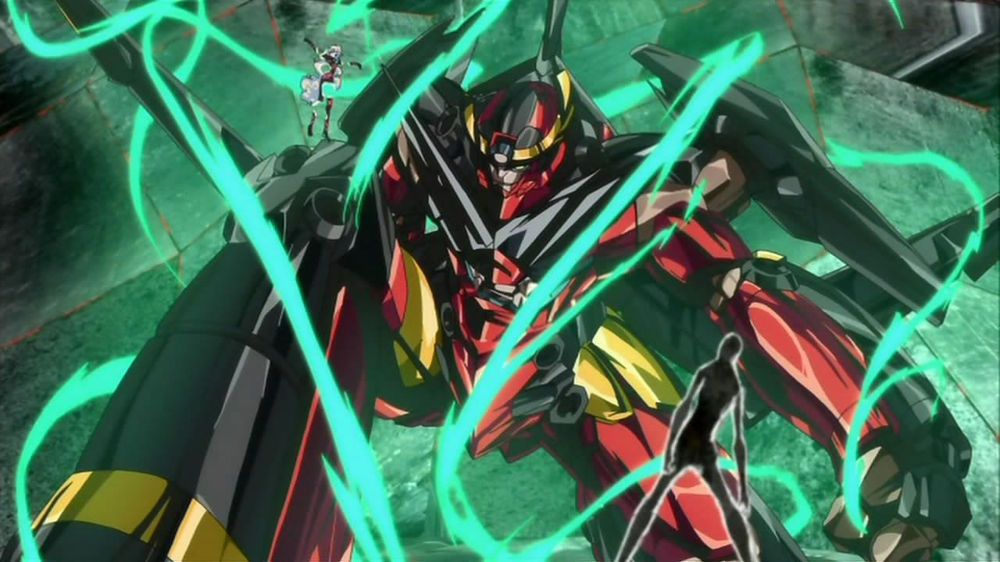

### Day 12 - Favorite mecha series

I am not that big of a fan of mecha anime. I haven't seen any of the Gundam or Macross series. I don't really watch anything that has giant robots in it, just not my thing. Aside from a few classics of course... Like [Gurren Lagann](http://anilist.co/anime/2001/TengenToppaGurrenLagann). This marvel made by Studio Gainax (now these people are in Trigger). The show itself is based in a post apocalyptic world, where humans are hiding underground from the alien overlords with giant robots. Until one day, this boy - Simon with his bro Kamina decide to put and end to it. Well lets say they did a bit more than that... Robots the size of the galaxy, what is this...

The anime is fast paced, has great animations, memorable characters and an amazing OST. What is there not to love? If you don't believe me, go watch it now!
