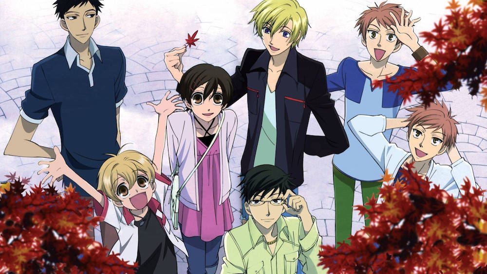

### Day 14 - Anime you've rewatched the most

I dont re-watch anime . I think it is a waste of time to sit there are watch the same thing over again, when you have seen it once already. I might re-watch a particular screen, or at max an episode, but not the whole series. Or maybe if a friend really wants to watch something together I might sit with them though a few eps.

So the only show that I have truly re-watched on my own will, was [Ouran High School Host Club](http://anilist.co/anime/853/OuranKoukouHostClub). I originally watched it on YouTube with English dub, but then at like ep 20, they stopped, and I had to finish it in Japanese with subs. That was in like 2008. Then, when I got to Sydney and had a lot of free time on my hands, I decided that it was time to re-watch this great show. So I did. Nothing will even beat the original voice acting.
