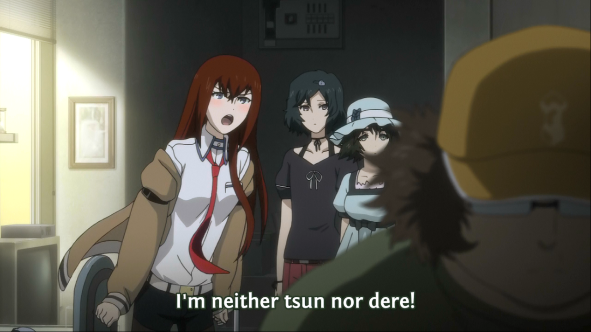

### Day 17 - Favorite tsundere

Ah "tsunderes" (or as autocorrect always tries to correct me: thunders), this personality trope exists in pretty much every anime out there. And my 19 year old self was completely in love with them. Why? Because they abused the main character all the time, but deep down they actually loved them. I found that sweet (or maybe I am just an M, who knows).

My pick for this day though is Kurisu from Steins;Gate. Kurisu is a scientist, so she is smart and she is also very curious to the concepts and theories that science has yet to prove, and a tsundere. I think to my now 22 year old, Kurisu is the only tsundere that is actually loveable. She is mature and actually accepts her feelings, while still someone acting tsun to the MC. Also she is very strong as a character, which makes me very fond of her, but more importantly, the tsundere trait isn't the defining thing about her. I guess this just goes to show that tastes change over time, and maybe in a few years, I won't like tsuneres at all, and only look at mature and relatable characters... who knows.
