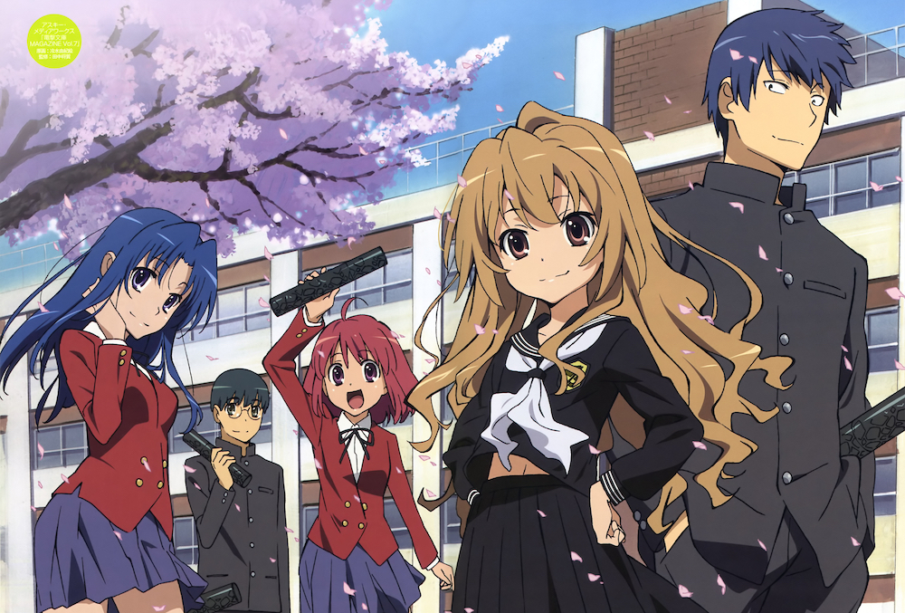

Continuing on with the daily my daily anime questions.

### Day 2 - Favorite anime you’ve watched so far

This is a hard one. Picking a favourite anime out of [this list](http://myanimelist.net/animelist/jamiejakov)... But if I had to chose one, I'd probably stick with [Toradora](http://anilist.co/anime/4224/Toradora). It was my very first favourite and I want to keep it as my most favourite because of the plot, characters and general atmosphere of the show. Though I wouldn't go around and recommending it to every single person I see, and I won't say that all other anime aside from it is bad, but it will always have a soft spot in my heart.

Aside from Toradora, I'd say my other favourite would be the Monogatari series, as it a beautiful peace of animation,with great character development, engaging dialogue, thought provoking themes, deep plot, intelligent humour, symbolism.... [meanwhile at Shaft](http://i.imgur.com/ApGFIRk.jpg). I also guess that Taiga and Shinobu are the sole reason why I love tiny girls so much. But thats a discussion for another post.

Essentially anything I give a 10 on my list is a favourite of a genre, or has something unique, that other shows have not been able to show me. And I of course would recommend you take a look at those shows, if not all then at least some.
