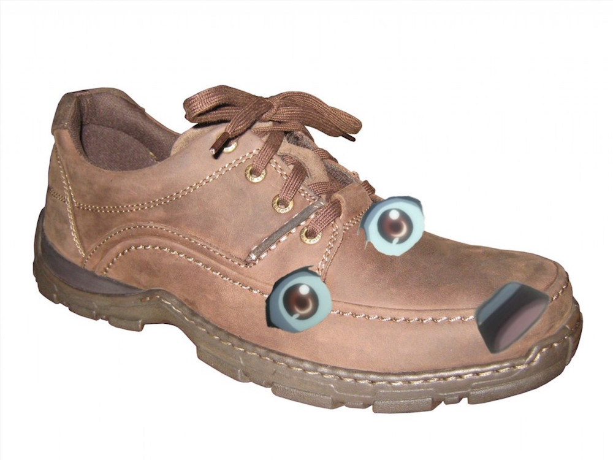

### Most annoying anime character

I am not going to go on a ramble on how a lot of anime MC's are useless and annoying. I will just mention one, which in my opinion ruined the show. Ouma Shu from [Guilty Crown](http://anilist.co/anime/10793/GuiltyCrown). He was worse then Shinji in Eva... just annoying and clueless. The show was great, music was epic, art was beautiful, but Shu.

I don't have much more to say, without fully bashing the guy, so I will leave it at that. Tomorrow will be an interesting one.
