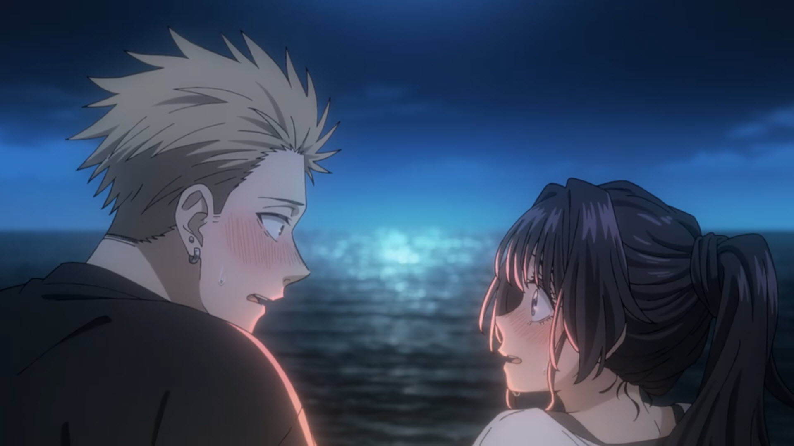

Oh I have a lot of favourites. Such as: Ryuuji and Taiga, Araragi and Senjo, Izaya and Shizuo, Isaac and Miria... etc... But I guess at this point in time I would have to say Takeo and Yamato from Ore Monogatari. Why? Well because their love is genuine and out of pretty much every anime I have seen, this is the only one which focuses about 20 episodes on the relationship after they have become a couple; the hurdles of being in a relationship and the overall satisfaction when overcoming these obstacles. Thats what puts the as my favourite anime couple. Because they are the most realistic one, not over dramatic and crazy, just plain rabu rabu and cute.

### 2026 update:

I would without a doubt say it is Rintaro & Kaoruko from [The Fragrant Flower Blooms with Dignity](https://myanimelist.net/anime/59845/Kaoru_Hana_wa_Rin_to_Saku) because of how wholesome they both are, and how pure their relationship it. Which is actually not that different from Takeo and Yamato.
