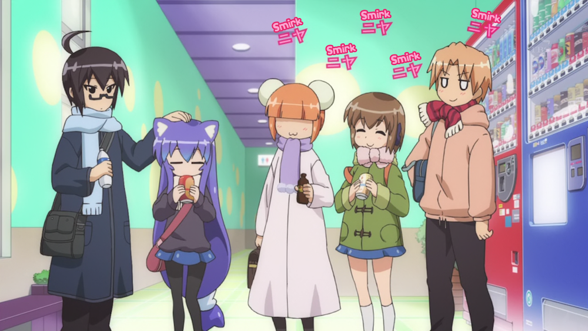

### Day 8 - Anime you remember most fondly

Of course the answer to this question would be a slice of life anime. Slice of life anime are very fuwafuwa (fluffy) and light hearted. Some are funny, other make you tear up, but [Acchi Kocchi](http://anilist.co/anime/12291/AcchiKocchi) makes you go awwwwwwwww. Based on a 4 coma manga, each episode of Acchi Kocchi presents us with a number of gags, misunderstandings, and just silly moments in the relationships (friendships) of the above 5. And then we got Io and Tsumiki, who are like the perfect couple, but are too shy to admit they have feelings for each other. Oh and did I mention that Tsumiki is a cat? Like whenever Io pats her on the head, she grows cat ears and a :3 mouth.

Of course there are other anime which warm up my heart, but Acchi Kocchi has done it in a way that on only makes me go nya, but also in way that makes me go HHNNNNGGGGGG.
