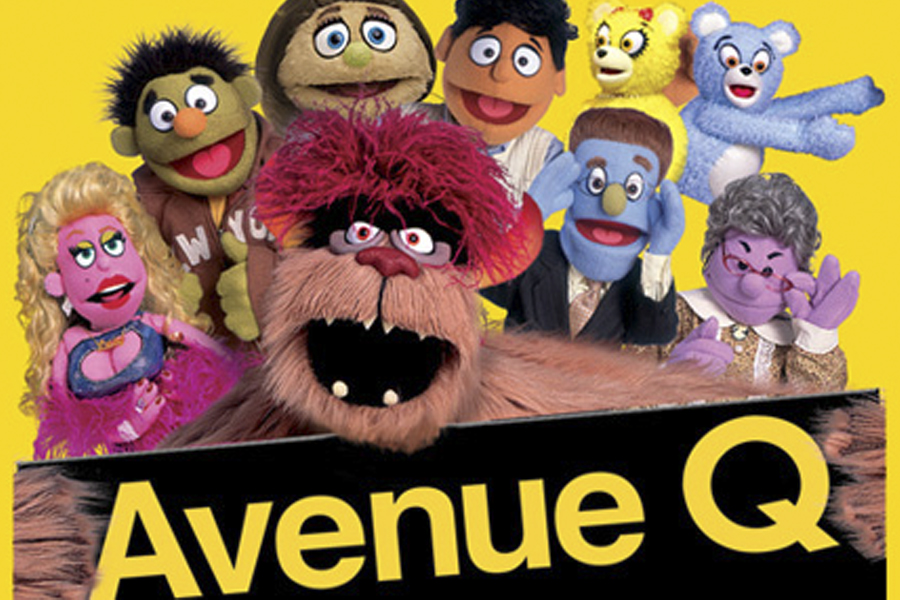

So far I have only been to one musical, that was "Mamma Mia" on Broadway NY in 2009. But yesterday Amy and I went to see [Avenue Q](http://www.wikiwand.com/en/Avenue_Q) at the Enmore Theatre. It was a great show, and I can say, I laughed so hard my cheeks were hurting. Before going in to watch the musical, I had no idea what it was about or anything, aside from Amy's brief explanation that it has something to do with [Sesame Street](http://www.wikiwand.com/en/Sesame_Street).

After watching I can give a brief plot summary. The story takes place in New York on, you guessed it, Avenue Q. We are shown the life of all the residents and a new collage graduate struggling to make ends meat. Even though they might seem like a regular bunch of people (and monsters), but they all have something that makes them special. Like Tod, who is gay (even though he doesn't want to admit it) living together with Nicky, unemployed college graduate; Brian, the jewish ex-baker with an oriental wife - Christmas Eve; Trekkie, the monster, who ... utilises the internet to its fullest potential; and others. What else makes them all special, is that they are all *just a little bit racist, for now* and of course, _it sucks to be them, if they were gay._

And now I finally know where the some of the viral songs and memes come from. Overall great show, very happy Amy invited me to go. Her is a [link for the playlist of songs](https://www.youtube.com/playlist?list=PLBCD2CF3875E6997C), but I would highly recommend that you go watch it yourself if you can.
