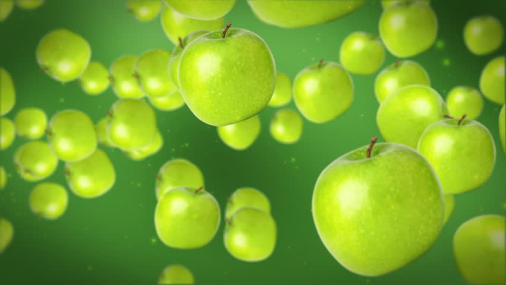

You know how much I love Apple and apples. I love the tech and I love eating all sorts of delicious fruit. What I don't like, is when apples start flying. Now that, my friends, is terrifying.

Las night I was heading back home at around 11pm. Then while walking back home on the empty roads of Rhodes, minding my own business, I hear a whizzing sound of something falling, I thought it was a bird flying by, or maybe a broken tree branch, but I was greatly mistaken. A Granny Smith apple had fallen onto the bonnet of a parked car.

As any normal person, I look up to see, wether I was walking past an apple tree. Which I was not, and where it came from I could not spot. Leaving it be and proceeding home, I was bewildered by the apple that'd flown. A few seconds later, and to my surprise, another apple had fallen from the skies. This time much closer to me, so I couldn't just ... let it be. Pretty damn shocked I ran for my flat, away from all these apples that fly and go splat! Reaching my room and telling Alex the story, he laughed for a bit, but then he got worried. Crazy people are crazy indeed, lets be a bit carful. Agreed!

Hope you liked my little tale. I tried to rhyme the best I could, cause I thought I might be a poet, but didn't even know it!
