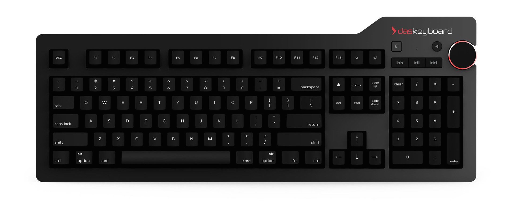

Ever since coming back from Japan, I have been upgrading my life. I got a new apartment, a whole lot of great furniture, new job (upgraded version of old job), new clothes, a 5k iMac, and now some more shiny new things. For years now I have been longing for batter typing experience - a mechanical keyboard. But since I was going to Japan and then in Japan, I could never really get one, cause they are heavy and bulky. Fast track to the beginning of the month. My WoW Cataclysm gaming mouse, which served me well for 5 years, has started to show signs of death, it may not be dead yet, but definitely breathing its last breaths, so I started searching for a worthy replacement.

---The main criteria for a new mouse was that it must be wireless, and I mean wireless and dongleless. I wanted a Bluetooth mouse, that would not use any USB ports on my iMac, which only has 4 and they are all taken for my HDDs (and now new keyboard). It was hard to find a good quality mouse with more then the standard number of features which is also bluetooth. And during this search I started thinking. Maybe I could get a wired mouse and just plug it into a keyboard that has extra USB ports, that could solve my issues. So I looked into keyboards, and what do you know - [DasKeyboard](http://www.daskeyboard.com) just released the Mac version of its new DasKeyboard 4. You can see what it looks like on the header image, and boy it looks pretty! That was an instant purchase. But hey, wait a minute, what about the mouse? And so the search continued...

Until I somehow found this little beauty: [Logitech MX Master](http://www.logitech.com/en-us/product/mx-master). It is Bluetooth, it feels just like my old WoW mouse, it has Mac supported gestures, and it even has a sideways track wheel (thats gonna be useful for photo editing - I thought). So I got it as a present for Lexi (he owed me a birthday present). Now my setup is complete.

**DasKeyboard 4 for Mac Review:**

The main feature of any mechanical keyboard is of course the clicky keys. I selected the cherry blue keys and I say for a fact, they are loud. But thats exactly what I wanted! They keys are smooth and the keyboard itself feels very sleek. Whats great are the dedicated OS X keys like brightness control, playback controls, sleep button, fn key and of course a great looking volume knob. The keyboard also has 2 USB 3 ports at the top, so thats great as all the other USB ports in my iMac are taken up by hard drives. DasKeyboards are rather pricy (+Australia Tax), but I do believe the it is worth it. I can see myself using this keyboard for a long time for writing assignments, writing code and of course gaming. The only negative aspect of it, is that the cable looks and feels cheap and doesn't look as elegant with an iMac, but thats just aesthetics.

**Logitech MX Master Review:**

I am very happy with this mouse. It embeds everything I desired in a mouse for my iMac station - bluetooth, back and forward buttons and smooth scrolling. In the end though, I got so much more. The mouse has Mac gesture support which is activated by pressing the button under your thumb and drawing the mouse in one of the four directions. It has a very very nice scrollwheel, with 2 modes, slow and tactile, or fast and smooth. I switch between the 2 regularly depending on the task that I am preforming. The mouse also has the capabilities to work with up to 3 different computers, so I have already paired it with my iMac and MacBook Air. Charge wise, it has been a good week and I have yet to charge it once, so I am very pleased with that. One down side is that the bottom pads get scratched super easily. After a week of use, they look like I have used them non stop for 4 years. But since you don't look at the bottom that often, I am not too worried about it.

Overall I am extremely pleased with my upgrades and looking forward to getting new the OS X software, new iOS software and perhaps even a new iPhone in September.
