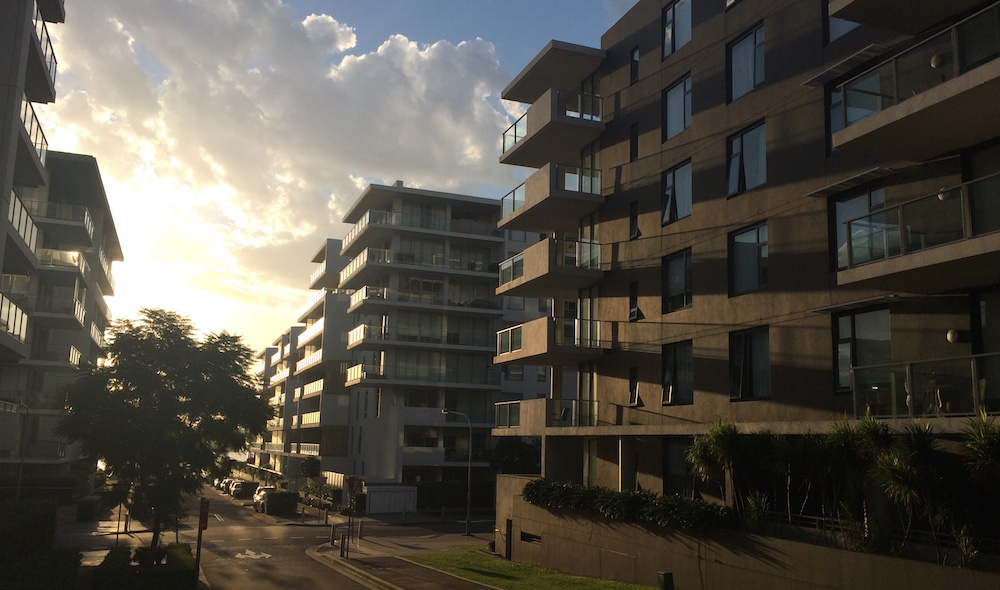

Almost a year has passed since I left beautiful Sydney. And now I am back, back to a new year of uni, new job, new apartment in Rhodes! But at the same time I can now see all my good old friends, eat all the amazing food I have been missing out on, and spend 3 times more then I should on daily necessities! Yay for Sydney!

But seriously, I came back on the 17th of February, which is a month ago. I've been very busy with buying furniture (from IKEA), seeing friends, going to uni again and 20 hours of work a week. All I can say I am happy to be back, but at the same time I do miss certain things about Japan. Right now I am trying to hunt down a place where I can buy a simple bicycle for a decent price (not in the 1k range). Aside from that, the apartment is mostly furnished, just waiting on dining table and sofa.

My life is back on track, so I will end this small update post by saying that while life can be hard some times, and we have so little time to do all the things we want, its important to appreciate every little thing that has happened, and continue going forward!
