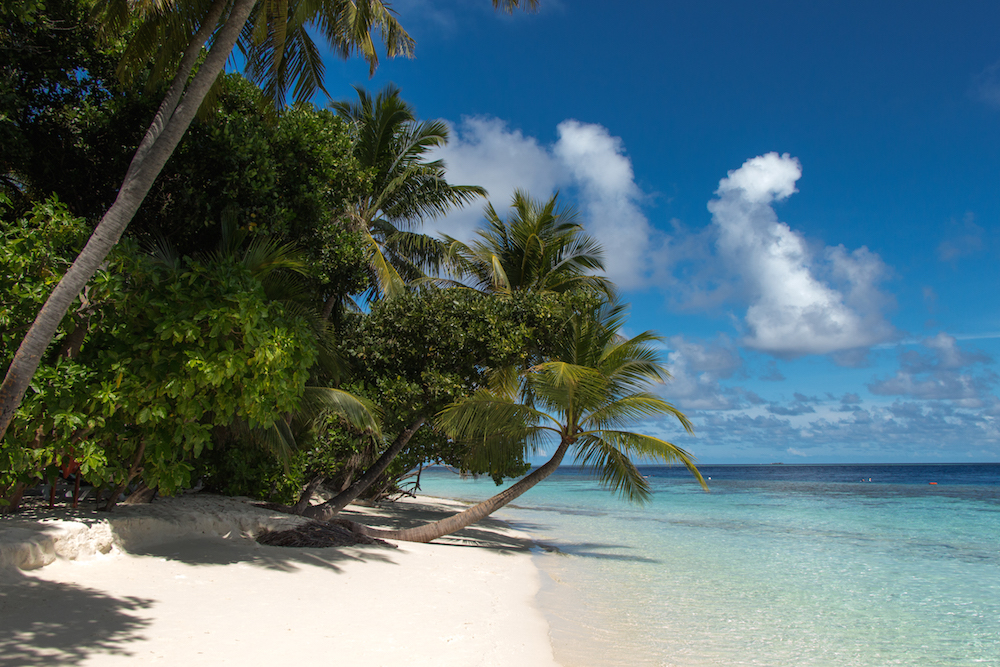

Ah the crystal clear azure sea, the white sand of the beach and the green trees, so beautiful, so tranquil - these are the Maldives.

Honestly after spending 7 days on the island all I can say is: its bliss. If you are in need a rest and have enough funds to back it up, I say go for it! It will be the time of your life. All you do is lie on the beach, eat delicious fruit and go snorkelling to see all the colourful fish down bellow. So bring your sunnies, snorkelling gear and a good camera (normal and underwater) cause you will see so many beautiful things that you will definitely want to keep these shots forever.

Now its time to get back to my normal life: work and uni here I come.

Photos are right here:

