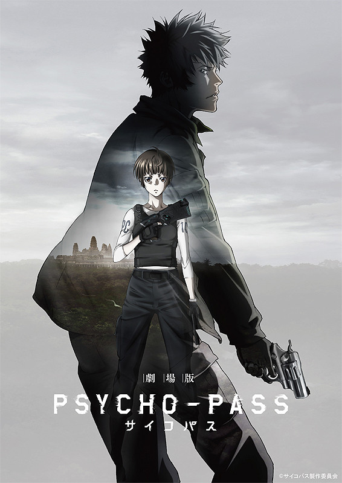

Set after the events of season 1 and 2 this movie brings a new arch to the Psycho Pass series with a new story while bringing back some familiar faces. If you haven't watched seasons 1 and 2, there is little to no point of watching the movie as it revolves around established ideas and characters. Though season 2 was not as well accepted as the original, it is still worth watching as it hold some key plot points which are discussed in the movie.

For those who have seen the previous seasons, they will be pleased to hear the Gen Urubuchi is back in charge and he once again does a marvellous job of creating a new environment and portraying the characters in that setting. Before I continue any further, I would like to warn everyone that if you press "Read More" then you will be spoiled for seasons 1, 2 and parts of the movie.

---

**\*\*\*\*\* SPOILERS\*\*\*\*\***

First please take a look at the trailer for the movie as it sort of explains the setting and what is happening.

<iframe src="//www.youtube.com/embed/Apzibx8oxkw" width="640" height="360" frameborder="0" allowfullscreen="allowfullscreen"></iframe>

**Story:**

The premise is that there is this group of foreigners who make their way into Japan and are trying to overthrow Sybil. Why, because their country of Shambala (real world Cambodia) has recently started adopting the Sybil system and that has turned the country into a war zone, where the government is trying to eliminate all resistance.

After the foreign threat was eliminated and two of the infiltrators were caught, our beloved moe inspector Tsunemori Akane starts to interrogate them. However Sybil takes it one step further and just analyses the brain of one of the terrorists, thus killing him in the process. What they (yes Sybil is a they) found out is that the terrorists are from Shambala and that the war is becoming a very serious issue for the country and the continuation of adopting the Sybil system there. Furthermore Akane is shown a few images of Kougami, who is apparently helping the resistance with the fight against the government. To see if it was Kougami who was responsible for the attack on Japan, Akane requests to be sent to Shambala to research the situation and find Kougami.

Upon arrival she sees the brutality of the local forces towards the population and the poverty in which almost 90% of the people live in. Then she is welcomed by the leader of Shambala (who's name I just can not remember) and the commander of the army AraraIzaya-Nicholas Wong. All I can say... he is a b\*tch.

The city of Shambala Float is just like Japan, it is safe and everyone living there is protected by Sybil. Or it would seem that if it weren't from the large number of people wearing these blue collars which indicate that they are Latent Criminals. These people are allowed to live in a normal society and earn points, which should help them decrease their Crime Coefficient and keep their Psycho Pass clear. Basically they are treated as slaves, while the "good" people can enjoy life in a perfect society. And then there is the rest of the country which is outside of the walls of Shambala Float, they are all labeled as unworthy and treated as scum not even worth of a Latent Criminal status.

Akane joins Wong-kun on their operation to take out some more rebels and thats when she finds him, Kougami. Disobeying orders and jumping into the fire, she finds him and runs off. Instantly labeled as a criminal by the Shambala army she escapes with Kougami to their base in Angkor Wat (I am serious, their base in the temple of Angkor Wat).

Without going too deep into the dialogue and everything, they talk things out and decide to overthrow the corrupt government together and stop the war. She returns to the capital, while Kougami gets captured and dragged to the capital. Final stand off on the roof didn't go as planned. Poor Wong-kun is dead, along side with his whole army, thanks to the crew from Tokyo, they showed up right on time. Apparently the government modified the Crime Coefficient values of their whole army and made it so that they are within normal range (under 150), whereas the true values were way over 400. How they did that, I didn't not quite get though.

Akane goes after the leader of shambala and has a long chat with him and Sybil. And Kougami takes care of the mercenaries who captured him and then runs off into the unknown.

**Comments:**

The most important thing I would like to mention is that because I watched it when it came out in Japan, I did not understand the important dialogues: the one in the plane with the sensei and Sybil, and the final showdown between Akane and the leader. Due to that I can not fully comment on how great it was, as I did not get it. But from what I could grasp, Akane's logic is bulletproof and Sybil listened to her again.

The action though was gorgeous. That animation quality, that CG, truly worthy of Psycho Pass.

Many people wanted the movie to finish the story of Psycho Pass, but I can say that it was just another arch, but it established some new ideas and I believe it finished up Kougami's role in the show and I doubt we will see him in any future Psycho Pass installment.

Overall it was a great experience, even though my knowledge of Japanese was not enough to fully understand it. Would watch again.

Also when watching a movie at a Japanese cinema, you get some free goodies. This time I got [this small booklet](http://imgur.com/a/2cp7v) with character designs, backgrounds and images of the weapons used.
