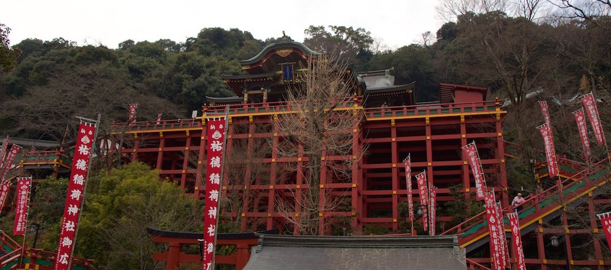

For the past few weeks, a few of my friends from Sydney have been exploring the land of Japan by traveling to places around Tokyo, Osaka and now coming all the way to Kyushu. On Saturday afternoon we met up with Richy and Ling, who made their way from Tokyo on the shinkansen this morning. Also a few other familiar faces joined us that day when we went to Dazaifu Shrine. The shrine itself is not much different from most other shrines in the country, but it is definitely a very popular place. The sheer number of tourists at the shrine showed us that not only Tokyo can be popular with the foreigners. After making our way back to Saga that evening, Amy, Ling and I went to meet the gaijin gang of Saga university and had a few drinks with them. It was fun to see how well foreigners get along in Japan, where you are treated as a foreigner no matter which country you come from.

The next day we ended up sleeping in, which threw us off schedule for the rest of the day. But we still managed to visit Yūtoku Inari Shrine in Kashima City, Saga Prefecture. And thats the shrine you see on the top of this post. Its a giant structure with big support pillars, which honestly looks fake, as if it was a toy or made out of plastic. But it is very very real and impressive. With the day coming to an end we made our way to Ureshino Onsen to dip our feet in some hot and healing waters. And then to finish off our adventure, we went to a yakiniku (Japanese BBQ) restaurant, where we ordered this big platter of Saga beef. All I can say is that it was amazing. Even thought I have lived in Japan for over a year (overall) now, I am still easily impressed by how delicious it is.

Also one thing I would like to note is that lately I have been getting really into photography, so after watching a bunch of tutorials on taking and editing photos, I can say that all of these were taken in raw format (most in AV setting) and have been edited with Aperture. Please do take a look at what I have created.

