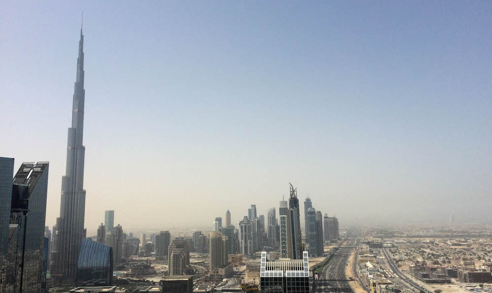
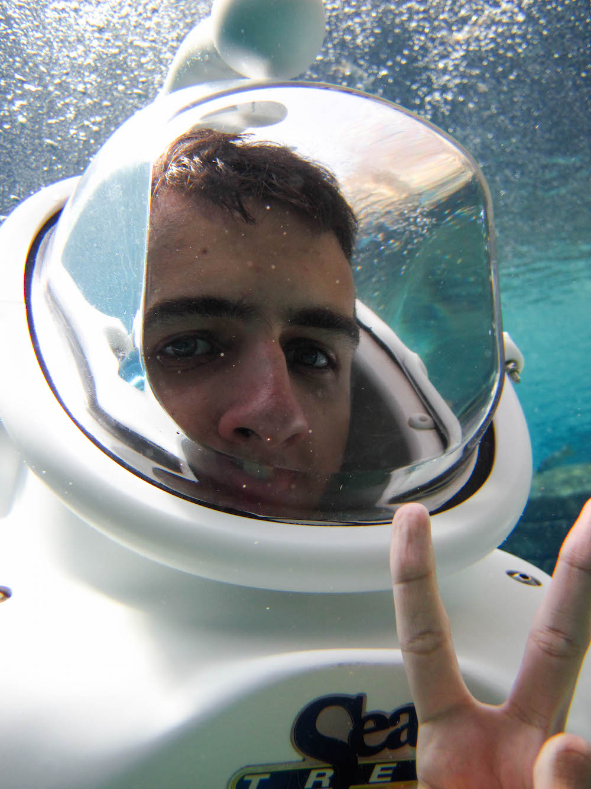
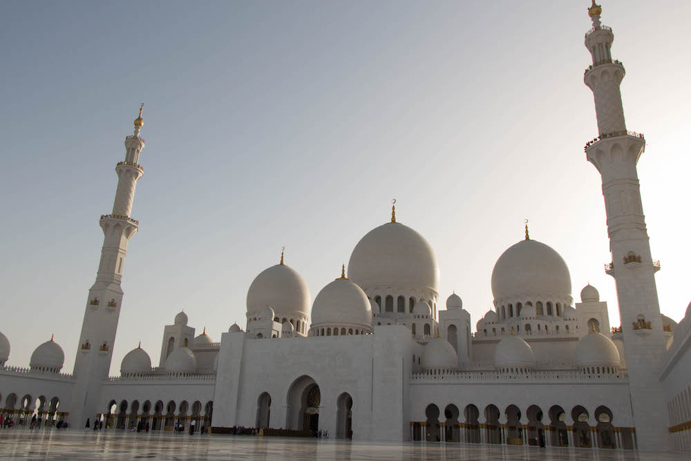

Welcome to another exciting episode of: 'Vadim goes traveling around the world'. This time he is visiting the land of sand and oil - United Arab Emirates. What did our young traveler find in this distant Arabian land? Find out after the break.

---

Hope you liked that intro, anyway let me tell you about Dubai, Abu Dhabi and the desert. After arriving in Dubai, taking the metro to the city and checking into the Warwick hotel near the financial district, I had some time to stroll around the city while waiting for my parents arrival on a later flight. The city is big, like seriously huge, there is a 14 lane freeway in the middle of it for gods sake. It boggles my mind to event think that all of this was built in the last 20 years on top of sand and water. Dubai as a city is very rich and expensive, you can see luxurious cars and clothes everywhere. Honestly though, the price of some items is exactly the same as in Sydney (looking at tech prices).

When my parents arrived we went to the heart of the city - [Dubai Mall](http://www.thedubaimall.com/en/Index.aspx). This place is like the campus of USyd filled with shops, stalls, boutiques, parlours, restaurants, and an aquarium. The mall is huge and has 1200 different shops. In the evening they have a beautiful fountain show. It goes from 6pm till 10pm every 30 minutes. I would highly recommend watching one or two of them as they are all different and very pretty.

We spent all of next day having fun and enjoying ourselves in the [Aquaventure Waterpark at the Palm](https://www.atlantisthepalm.com/marine-water-park/aquaventure-waterpark). Not only did we get to go on a bunch of rides and slides, but we also took part in the underwater fish viewing experience. They put on these white helmets onto us and gave us water tanks. There were a bunch of fish swimming all around us, so cool! My dad had a waterproof camera, so I had the opportunity to take a bunch of photos down there, and I even took a #underwaterSelfie.

Next day was spent 120km to the west of Dubai, in the capital of UAE - Abu Dhabi. There they have two main attractions: Ferrari World - a giant Ferrari themed park and the largest mosque in the country. In Ferrari world we had the opportunity to look at the history of the cars and racing, eat some good Italian food, and even ride on Ferrari powered go carts. Then we went to the grand mosque, which can hold up to 40,000 followers at a time. Its spacious and gorgeous. They have the worlds largest carpet and chandeliers by Swarovski.

And last but not least, we went on a safari in the sands. Ridin in Jeeps in the sand was pretty awesome. It was a bumpy ride, but at the end of it, we got to see the sunset, ride some camels, and drink some Arabian coffee.

T'was a great holiday, now the hard work begins. For then next 8 days My family and I will staying in a resort in the middle of the Indian Ocean on one of the islands of the Maldives.

But for now, here are my photos on

