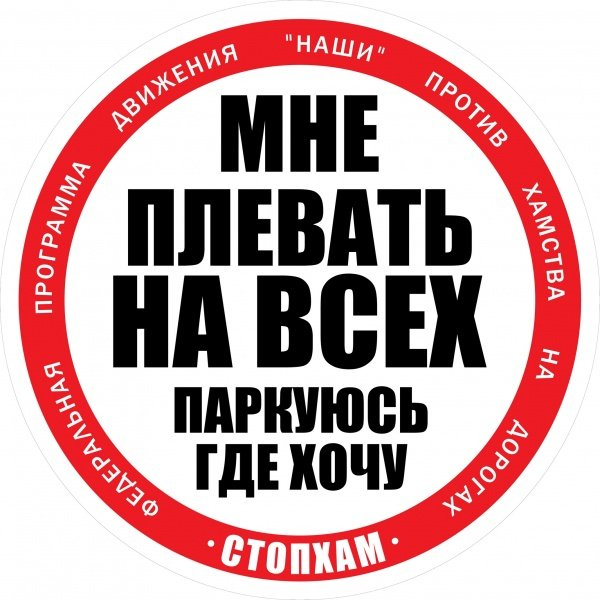

Стоп Хам (Stop a Douchebag) is a youth movement which fights against traffic rule violators and arrogance on the roads of Russia. They fight against people who park their cars in the middle of the road, sidewalks or even pedestrian crossings. They also fight against people who think they are the smartest and drive on the sidewalk to save time and go around a traffic jam. Why do they this? Well if its not them then who? Who is going to fix this mess that roads in Russia have become? There is a saying in Russian: "We only have 2 problems in this country: Idiots and Roads".

<!--more-->**What do they actually do?**

They stand around on sidewalks and wait for cars to come at them. Sometimes they are met with smiles and laughter, but more often they are met with arrogance and violence. People in Russia (and other former USSR countries) don't like following rules, they don't like obeying simple traffic laws. Why? Well because they think that they are the smartest, that they can outsmart the herd of sheep that are blindly following rules, that they are above the law just because they have more money or power. Well these young guys and girls here to prove them wrong. They don't take bribes (unlike the police), they won't move because they are threatened, they won't back down because this douchebag is in luxurious Mercedes car. Most of the time it goes well, they get to a resolution, but sometimes things get waaaay out of hand.

<iframe src="https://www.youtube.com/embed/BHJxIwvFIGY" width="640" height="360" frameborder="0" allowfullscreen="allowfullscreen"></iframe>

Here is their official (Russian) [YouTube channel](https://www.youtube.com/user/stopxamlive), which has over 374,000 subscribers, so I recommend you take a look and see just how amusing bad the situation is.

And here is an [unofficial channel](https://www.youtube.com/channel/UCMrKscEv_Ri1pvlRsLxsqJQ) that adds English subtitles to the videos. So check it out and lets pray for their success.
