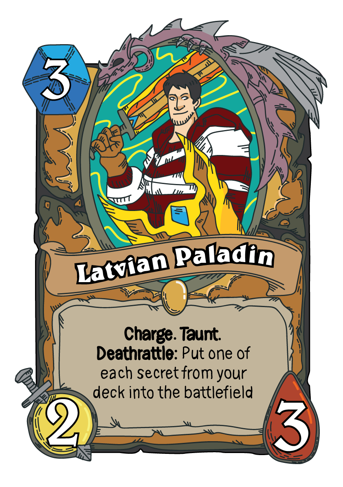

As you all know, Blizzard has made a lot of great games in the past. Memorable titles such as Warcraft III, Diablo II, Starcraft and of course currently WoW have all been hugely successful in their genres. One of their latest games (well it came out in 2014) is Hearthstone. It is a collectable card game, where you fight one on one against opponents from all over the world. Hearthstone is based of the Warcraft universe, so for people who have played Warcraft III and/or WoW, the characters/minions/spells will be very familiar.

Like any other card game out there, you have a deck, which contains minions, spells, and weapons. Each hero has 30 health and your objective is to bring down the health of your opponent to 0. Its a lot of fun, and you gotta give props to blizzard for making a f2p game for the masses, that can be played on mobile and doesn't require much skill in order to play. Of course if you want to reach legendary rank, then you need skill, luck and a whole heap of cards.

---Well since I started playing it more often in December, it has become my goal to reach Legendary as soon as possible. So I started reading up on decks in the current meta, watching pros play in competitions and stream games, and just play more to practice and climb up the ladder. Last season I reached rank 7, which I think is very decent for me, who only started properly playing in December. So now its time to take that extra step and achieve something worth telling people about.  Also very recently I have been turned into a hearthstone card myself! I am MC aka John Cena aka Dr. 6 - the staple of secrets paladin. My girlfriend (at the time) Amy has made a card that perfectly represents me! I am the Latvian Paladin. I charge my way to victory. I taunt all the lowly people on my way. And I will definitely reveal all my secrets when I die (my hard drives can guarantee that). But unfortunately these great stats did not make it to print, and I my great 2/3 for 3 mana became 2/3 for 7 mana, thus rendering the card useless and unplayable. But it will always live in the deck in my heart <3
