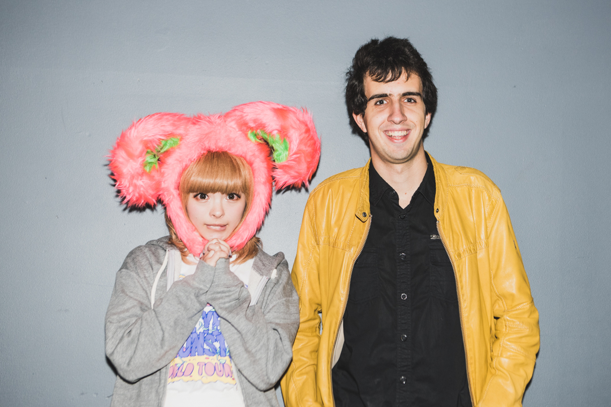

The fashion monster of Japan is back to Sydney for another live concert! This time as part of her 5 year anniversary world tour. Once again us Kyary lovers gathered to watch the pop idol perform. This time however, they had an option of VIP tickets, which allows the fans to get a photo taken with Kyary herself! (photos done by professional photographer and will be available for download on the 4th of July; See below!). Also included in the VIP package was the chance to be first in line for good and first to access the concert hall, which equals front a row position! That was probably the main reason that made this concert so much better then the previous - the opportunity to be really close to Kyary and actually see her face and cute smile.

<!--more-->And since I was so close to the stage, I managed to get some good photos with my phone. I say good, but phone photos of a concert can never be as good as a proper camera... But hey, at least its something. Link here:

And also I caught some 1080p 60FPS video of Mondai Girl and Invader.

https://youtu.be/LTQ9zWzhygU

https://youtu.be/BMaFaoJ7wdY

I sure hope these videos don't get taken down for copyright... It is a concert after all...

And of course the highlight of the night, a photo of me together with KyaryPamyuPamyu herself.

