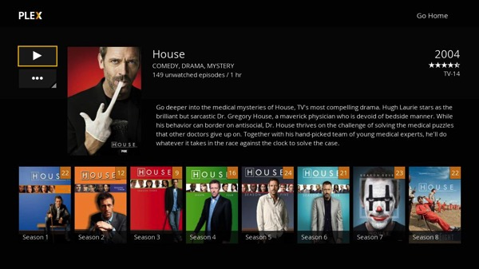

Continuing on from my previous [post](/posts/2016/my-home-media-server-nas/) about building a home media server, this time, I'll tell you about a brilliant piece of software called [PLEX](https://plex.tv).

So what is Plex? Its a media player system that automatically organises your media in a very lovely and intuitive interface. So say you got a folder of all your media (iTunes for example) and its jumbled up all over the place. So you would like to easily watch episode 5 of  season 4 of Game of Thrones? Good luck with that, you need to find the folder, then the subfolder wherever it was saved in, find the season, and then the episode. Now imagine that you are off at your  mate's place and you wanna watch the episode together with him, well then you are out of luck.

Not with Plex. Plex has a number of irreplaceable features:

---

- Organisation by show
- Synch with the [theTVDB](http://thetvdb.com) database for:
  - High-res images of the shows, seasons, and even episodes
  - Info about each show/season/episode
  - Actors, creators, studio, etc
- Language selection for the show info
- Keeping track of what has been watched
- Prepares the next episode once the previous has been finished
- Subtitle support
- Streaming and transcoding
- etc...

And of course, allows you to easily access it anywhere you may be, from any device you may own.

If you own a lot media and would like to have it all neat, tidy and easily accessible, well this is what you have been missing all your life.

PS: And you know what makes Plex even more epic? A smart TV like AppleTV or Chromecast. That way you can stream all your media to your TV and control it with the smart remote or your phone. And of course installing Plex on a NAS is the best, as then you can de-stress your PC and not worry about having it running all the time.
