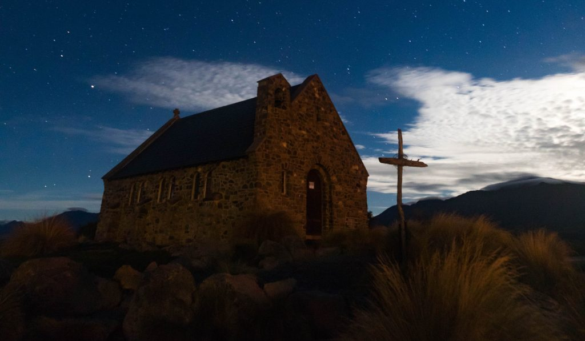

I recently got myself a new Camera - [Canon 5D Mark IV](https://www.canon.com.au/cameras/eos-5d-mark-iv). So of course I need to test it out by taking photos of the most beautiful landscapes in the world - New Zealand.

My colleague - [Anton](http://www.antongorlin.com) and I embarked on a journey to the land of Middle Earth, with one goal in mind: “take as many beautiful landscapes as possible”.

#### **NZ 2017 Day 1 - 16th April:**

We flew from Sydney to Christchurch on an Emirates Airbus A380, like you normally would, and enjoyed the great entertainment that was provided to us onboard. Upon arrival we instantly encountered our first issue - getting held up by quarantine. We were carrying a tent, so to remove all possible remnants of soil, quarantine had to inspect and vacuum it. After a small delay and a quick lunch, we collected our rental car and drove about 270km to Lake Tekapo. Arriving at around 10pm, our next struggle was to set up our tent. That proved a bit more difficult than initially expected. Mainly because it was 4 degrees outside, a bit windy, and we couldn't figure out how to assemble the thing. Eventually we got it done and I spent my first night in a tent. Oh we also took some night shots of the church!

