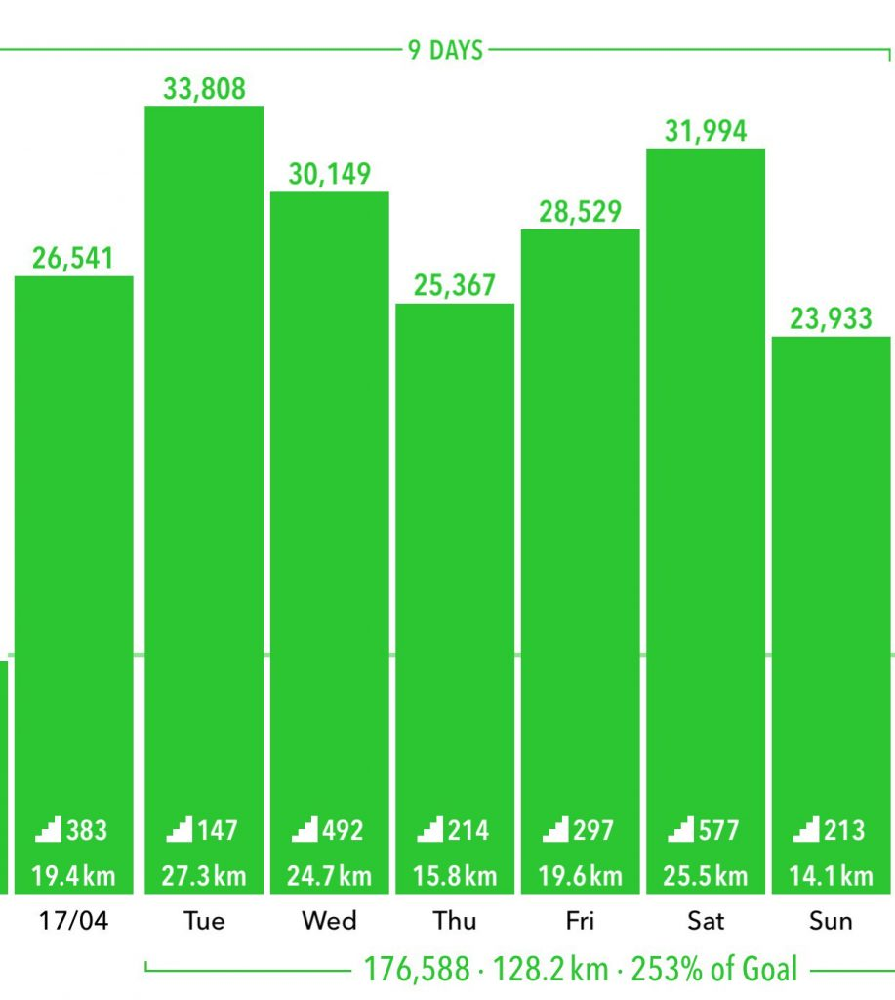

Well, looks like this is the end, its time to go home. My flight back to Sydney was at midday, so you know what that means? I can go for another sunrise!

I don't even know where we went this time, we just drove alongside the coast of the lake for about 20 minutes and then reached this lookout point. From there we had a great view of the lake, and the valley. Today was actually the first time when we had proper clouds during a sunrise. Both Anton and I were really happy that we managed to get some bright red colours on the clouds and mountains. Even if it only lasted a few minutes.

That's all folks. I am now heading back to Sydney and getting back into my old routine of work, club, and chilling with friends. Time to edit all the photos I took. (Edit: ended up with exactly 100 photos from this trip, down from 1.2k)

Look at how much I walked during the past week! I think I beat all my records.

