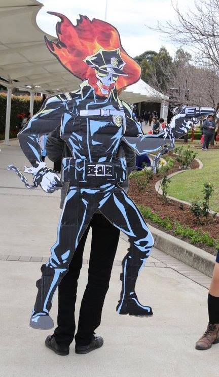

Every year I go to [SMASH!](https://www.smash.org.au) and every year I cosplay. This year instead of the usual "dress up as the character you like", I did something different. I actually brought the anime character into the real world! I brought [Inferno Cop](https://myanimelist.net/anime/16774/Inferno_Cop) to life.

It is impossible to describe what Inferno Cop is about. Its just a lot of random stuff happening for no reason, but god is it amazing. Studio Trigger was responsible for this masterpiece, and they have announced Season 2 a few months ago at a US anime convention. So what better time to show off my love for Trigger and Inferno Cop than at SMASH.

In order to understand why I did what I did, I have to explain that in the whole anime Inferno Cops limbs do not move. Thats right, he is not animated, when he moves its just a bounce, to turn around, they reflect the artwork. That is a low budget anime, and I made a low budget cosplay out of it.

It took me quite some time to make him. First I had to get a large enough image of him to print. As the anime isn't even released in BluRay, that proved rather challenging. I had to take a screenshot and vector every element on it to make him look just like in the anime, but also be scalable to 2 meters. Then I printed 20 A3 sized pieces of paper, cut them all up, stuck them to a piece of cardboard (which I took from work), cut out the cardboard, attached handles and a rope, and finally was able to wear him on my back. If I had to do all this by myself, I probably wouldn't have finished in time, but thankfully I had my good friend Cody and my girlfriend (at the time) Leah help me out with a lot of the cutting and gluing.

This was a great cosplay idea, an I might reuse him when season 2 actually comes out, or just as a prop for something somewhere at an AnimeSydney event.

This is not the first time I've cosplayed and definitely not the last. You can see all my previous cosplays [here](/tags/cosplay/).
