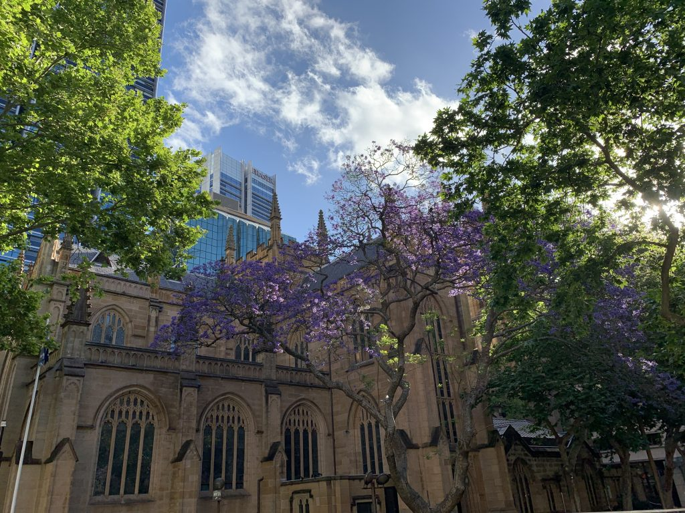

I’ve been holding off on getting a new phone for quite some time now, but the wait is finally over. Let’s welcome the latest edition to my tech family: a brand new [iPhone XS Max](https://www.apple.com/au/iphone-xs/) - iPhosphophyllite.

Why did I wait so long? And why did I finally decide to upgrade?

My previous phone was an iPhone 6S Plus, and it was an absolute powerhouse for its time. However over the past 3 years apple has greatly improved the iphones screens, their processors, their speakers, but most importantly - their cameras.

---

After iOS12 rolled out, my iPhone 6s Plus became fast and fluid again, but that was not enough to keep me interested in using it. I needed a better camera. So many times I’ve found myself in a situation where I would like to take a photo, but even if I did, it would look anywhere as good, as if I had my DSLR with me. But now with the XS, I can! And I have!

The photos that this device has produced are absolutely stunning. (Examples below)

Then of course the quality of life features such as FaceID and the full sized screen are very welcome and make me very happy to use this device.

Overall this is a great phone, and I can see myself enjoying it for the next couple of years.

  
