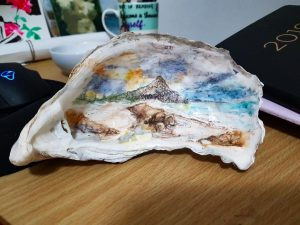

Have you ever wondered what it feels like being under a lightning cloud while in the middle of a desert? Well neither did I, until I was under a lightning cloud in the middle of a desert!

Over the weekend my photography mentor [Anton](https://antongorlin.com) and I set out on a sand dune photography trip. We did one of these a few years back, and it was really fun and produced a bunch of beautiful shots (check out [the album from 2017](https://www.flickr.com/photos/jamiejakov/albums/72157677531487334)). However this time there was 1 major difference - there was a storm heading toward Sydney that weekend.

Once we arrived at the Airbnb place, we straight away went to the dunes to get a glimpse of the storm, and we got exactly what we asked for. While it was not directly raining in the dunes, there were lightning clouds all around us. It was quite a frightening experience, but that's the only way to get amazing shots like the one above.

Another highlight of this trip was that we were staying at a house of an oyster farmer. He showed us a drawing someone made in an oyster for him, so I asked him for 1 oyster as well to give to my friend Sandra to draw in. She took [this photo](https://www.flickr.com/photos/jamiejakov/33206645098/in/album-72157706781505394/) that I took, and turned it into an oyster painting! How cool is that?!

The full album of the 2019 sand dune trip is [available on my Flickr](https://www.flickr.com/photos/jamiejakov/albums/72157706781505394).
