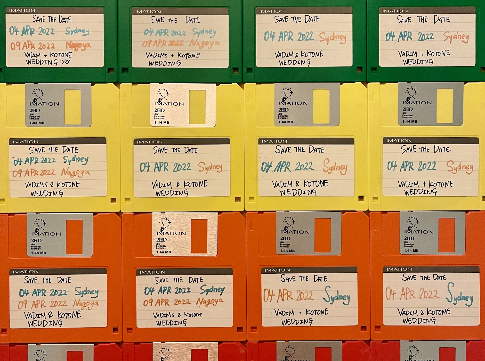

There are so many parts to planning a wedding, we were quick to realise that. But that didn't deter us, as we decided to do 2 weddings: 1 in Sydney and 1 in Nagoya. This way we can have my friends attend the Sydney one, and have us legally be married in Australia first, and then have a reception in Nagoya for Kotone's family and friends to attend there.

We decided early on that the wedding ceremony and receptions we wanted to focus on our family. The priority was to get our family to both of them, as we are so far from both our families for long periods of time. Also since we are doing 2 receptions, we figured the one in Sydney would be the western style one and for the one in Nagoya we would go full out traditional Japanese style.

---

We through about when to have these 2 celebrations, and thought that spacing them out would be inconvenient for my parents who need to fly from Europe, so we went with both being on the same week. But then which week, we needed to pick one. Summer and Winter seasons were ruled out quite quickly, as going from a winter Latvia to a summer Sydney then to a winter Nagoya would not be pleasant at all (same for the inverse). So it was spring or autumn. Since we started planning in Summer 2020, doing it in autumn was impossible, and spring was quite hard, so we went with Autumn 2020. And the day we chose for the ceremony was 4/4/22 (yes I love my repeating dates). Which was a Monday. And the Japanese reception would be the same week on the Saturday, 9th of April 2022.

Focusing on the western | japanese style as a theme, we started looking at the Sydney venue first. The venue needed to be easy to get to for my Sydney friends, but intimate enough that we wouldn't be on display for the world to see. It needed to be an older style building, more from the 1900s or 1800s with a space for a ceremony, and a large hall to fit our guests. We estimated that we would have around 50-60 guests at the wedding, cause if we went any larger, we wouldn't have time to spend with everyone on our special day. It also needed to be uniquely Australian, be it with a view of the harbour, a winery, near a beach, something that both my European parents and Kotone's Japanese parts would love and we could remember forever.

After a bit of research and visiting the place, we settled on the [Gunners Barracks in Mosman](https://gunnersbarracks.com.au/). It was perfect. It met all of the conditions and the hiring price for the date we chose was very reasonable as well.

Then for Sydney we needed to decide on all the other things: flowers and decorations, photographer, cake, music, transport, etc. But for Japan, it was a little bit more simpler.

In Japan you don't pick all the things separately from different vendors, you chose the venue and then the venue provides you will all the other vendors based on the package type you chose. There are different packages that suite different budgets, but all filled by folks who work in collaboration with the venue of chose. The venue also designates a wedding planner for our event specifically who would be our contact person for all the matters.

For the Nagoya venue we went with [Gajouen Nagoya.](http://www.gajouen.co.jp/) It has a great vibe, is very traditional, a high quality venue, does traditional catering, has kimono rental, and is in a rather convenient location only 15 minute train trip from Nagoya Station.

So with the dates and venues decided, it was time to give all of our friends as "Save the Date" card for the date. And we came up with the best idea for that - a floppy disk. Its used as a "save" icon on a lot of modern day apps, and it's a lot more unique than a simple card. It was a great idea and everyone loved it. We also hid a file on the floppy disk itself, for those of our friends who happen to have a floppy disk reader available to them.

 

**UPDATE Oct 2021:** Due to COVID restrictions on flying to Australia and Japan not lifting, and there being no plans in place to lift them by April 2022, Kotone and I have decided to postpone our wedding to 2023, so that our parents can come to celebrate with us. The new dates are 04/04/2023 and 08/04/2023. Hopefully we don't need to postpone again!
