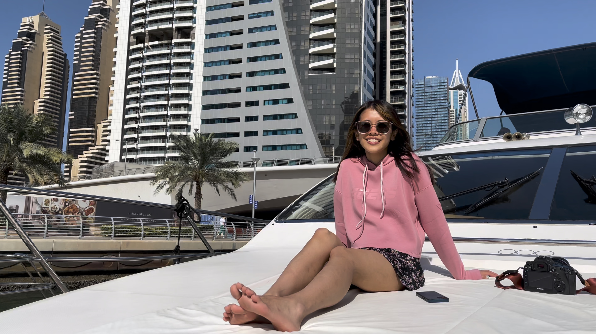
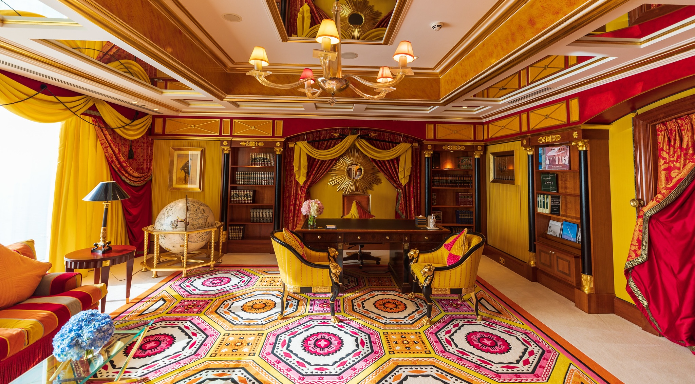
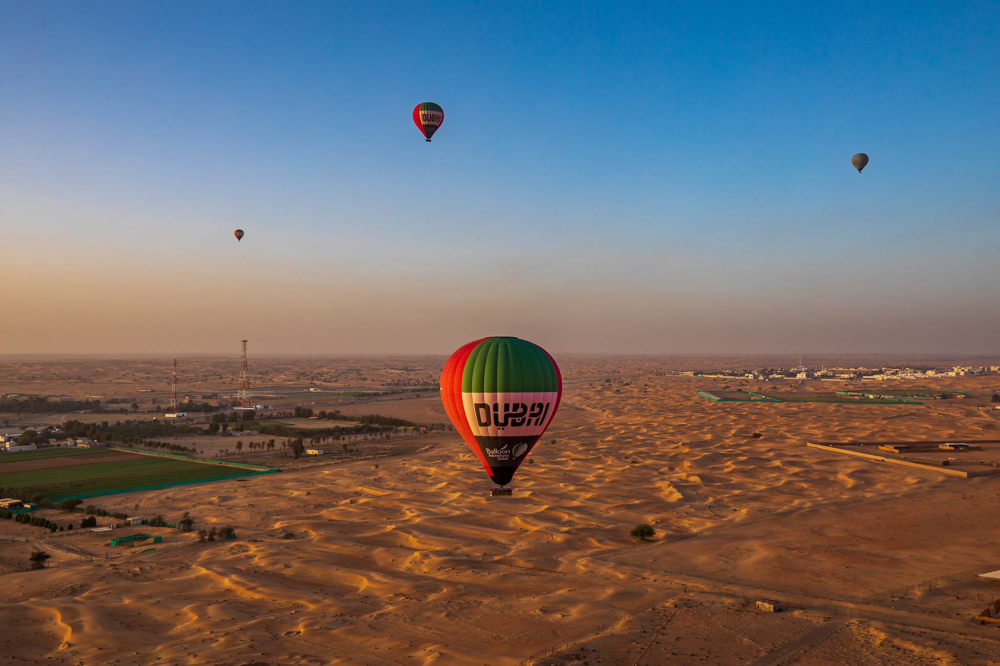
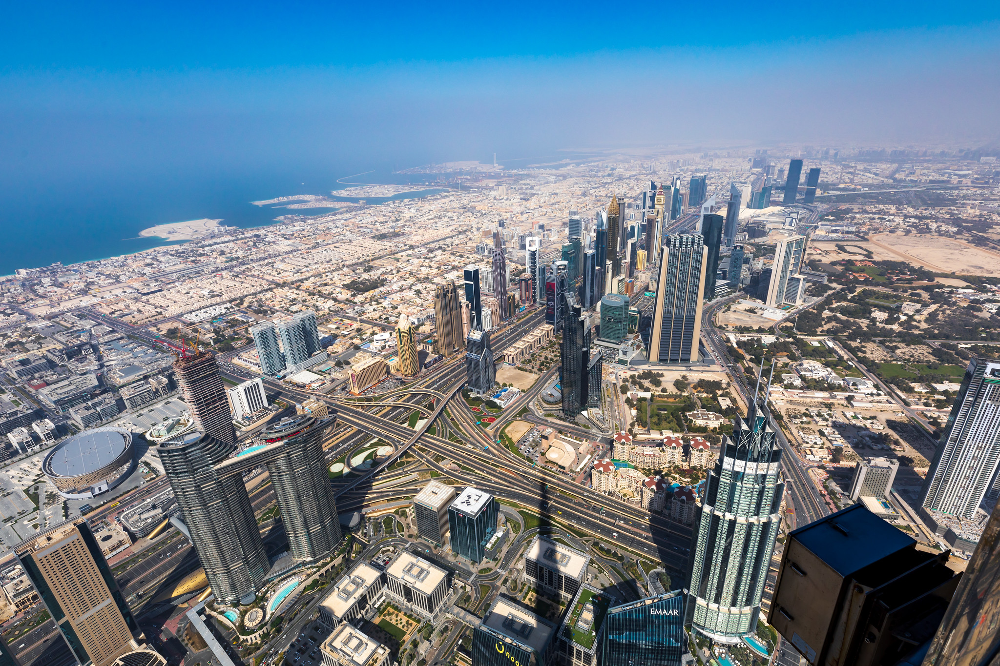
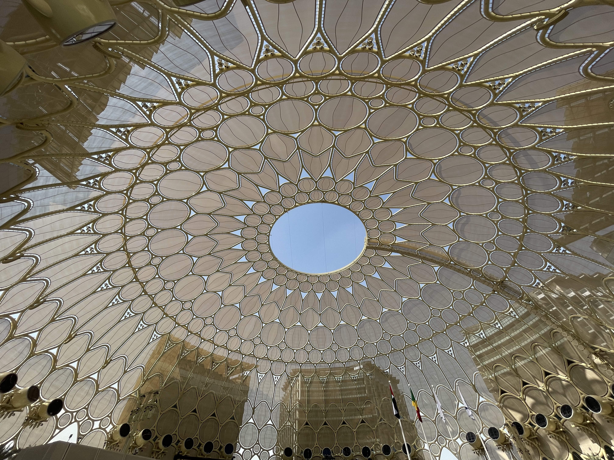

COVID times hit global travel hard. People couldn’t leave their own homes for months, and neither could I. But the time to travel has finally come again and our first trip is to the UAE - Dubai.

Dubai is one of the only places in the world that actually accepts tourists right now and it has the other large convenience of being right in the middle between Riga, where my parents are, and Sydney, where Koto and I are.

While I’ve already been there, this will be the first time for Koto, first time in the Middle East even. Koto is very open minded about travel and very curious to learn and experience different cultures (that’s why we are getting married [proposal here]), so she was keen to go. The Arab world is not really a travel destination that many Japanese people choose, it’s just not that popular. So by going, Koto is going to score some sweet bragging rights to her friends and relatives.

---

Because of COVID regulations we had to wear masks almost everywhere and do RAT tests a couple of times, but aside from that it felt like a normal holiday.

We swam in the pools and beaches, ate at various delicious restaurants, visited some amazing places, and even went for a ride on a yacht and a hot air balloon. #just_dubai_things

## The Yacht

Dubai has a gorgeous marina and in winter, when it’s not scorching hot, the wealthy businessmen of Dubai go on their yachts and party on the sea. My father knows one such man and he invited us to his yacht for an afternoon of champagne drinking, sunbathing and swimming in the bay. We totally lived the life of wealth and glamour for a few hours.

For Koto this was a surreal experience. She grew up in a rather small town near Nagoya, and now she is sunbathing on a yacht in the Dubai marina, who would have thought that life would take her here.

## Burj al Arab

Ever since I was a kid I heard about this 7 star hotel in Dubai, and I always wanted to visit it. I knew staying in it would be way out of my budget, but at least seeing what it’s like inside would be pretty cool.

Thankfully they have tours there and we went for it! The interiors are lavish, a lot of the times too extravagant for my tastes.

It’s interesting to know that there are people who want to be in this kind of environment. I honestly don’t, I’m happy to just take a look at it all for my own curiosity.

## Birthday Balloon

On your birthday there are usually plenty of balloons all over. Balloons are a sign of celebrations and parties. I love balloons, but I’ve only ever looked and touched them from the outside, I think it’s time to be on the inside of one.

And that’s what I did this year, we booked a trip on a hot air balloon! Woke up early, got taken into the middle of nowhere and rode on a hot air balloon through the desert on my birthday. Oh and we got to ride some camels afterwards as well.

It was a surreal experience and I am glad I got to spend my birthday with my parents and the love of my life.

## Burj Khalifa

And then to top it all off (pun intended) I really wanted to go to the top of the tallest building in the world: the Burj Khalifa. So Koto and I went for a wild ride up 500+ meters into the sky to the highest observation deck with no windows! The photos I got there are incredible. We also got offered Arab coffee and dates (they offer dates everywhere…) as well as other snacks and refreshments.

## Expo

Oh and one more thing, Dubai was hosting the world expo at the time. It was actually supposed to end in 2020, but due to Covid it got postponed all the way into 2022. We went there for a day to check it out. My parents and I really don’t care that much about all the deep details of every country's showpieces, so to the shock of Koto we went through them all quite quickly.

## Photos and Video

This time around not only did I take a lot of photos with my DSLR and iPhone, but Koto and I took a lot of videos as well, creating a beautiful travel vlog.

Here is the short version:

https://www.youtube.com/watch?v=OOIm8G94DgM

And we have 2 long versions as well, [1 from my perspective](https://www.youtube.com/watch?v=JVb_5tDUtS4) and [1 from Koto's](https://www.youtube.com/watch?v=06R1XB9E-Xg).
