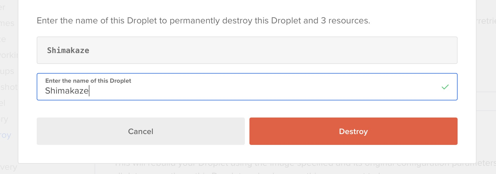

It has taken over 6 years, but I have finally fixed up my blog. I got to the point where I had topics I wanted to write about, but couldn't because my blog was an absolute disaster.
It got so bad that I legitimately had no way of fixing it aside from nuking the whole thing and started from scratch.

Let me show you what happened, how it all went wrong, and what I did to get to this new and improved blog post.
Welcome my new blog - Fen the fennec fox brings you a Fen-cy new theme!

---

My old blog was hosted on a Digital Ocean droplet running Ubuntu 18.04 with a 2019 version of Wordpress. It was out of date to say the least.
Software is a funny thing, if you leave it alone and don't change anything, you'd think it will be stable for many years. But that is definitely not the case.

What happened here was that my blog got overrun with various crypto bots and scam posts for random products in many different languages. They must've broken into my account, cause they were creating new posts as me.

So closer to the end of 2025 I started researching into what is the modern tech stack for simple blogs. A couple of things became clear:

1. Digital Ocean is no longer the best choice as it was back in 2014.
2. Nobody recommends Wordpress (and PHP) anymore, there are plenty of CMS alternatives

## Replacing Digital Ocean

I paid AU$9.00 per month for a linux machine running Ubuntu to host my Wordpress instance with a MySQL DB on Digital Ocean.
And I thought that was a good deal.

You know what is a better deal? Paying $0. And the way to get that is to deploy via [Vercel](https://vercel.com/). For small personal projects with little traffic it is **FREE**.

Deploying with Vercel is super easy as well - just create a GitHub repo and make a Vercel project connected to it. It will handle the rest. Every time I push a new commit to the repo, Vercel picks that up and deploys the changes, its quick and effortless, feels like magic sometimes.

So now I can decommission (destroy) my old Digital Ocean droplet - Shimakaze. You have served me well!

## Replacing Wordpress

There are many many options for how to serve the content of a blog. With the simplest being plain static HTML files. But that wouldn't allow for any kind of client side interactivity that I intend to introduce. So I need a framework that would allow me to write React and Typescript code that would then be transpiled to HTML + JS, but in such a way where the core - the blog articles can be static.

There is a perfect framework for this that is highly praised in the software engineering space (specifically by [Theo.gg](https://www.youtube.com/watch?v=3xqa0SsRbdM)), it is called [Astro](https://astro.build). Astro allows you to build basically static pages, and the specify which components need to be interactive and require JS execution on the client. This is great for performance and the overall experience - exactly what I was looking for.

But this doesn't solve the CMS problem. Wordpress was both a frontend UI and a CMS for managing the content. Astro is a framework for serving the UI. But it actually allows for a very simple way to set up a blog: [markdown files](https://docs.astro.build/en/guides/markdown-content/).

So what I have now is all my posts are in .md files in my repo, no expensive DB in site. They are easy to edit in any text editor, and by committing the changes to the repo on GitHub I can push the update up.

For all the old posts, I exported them from wordpress as an XML file, and then converted it to separate markdown files. It was a relatively painless process, which I am really glad about.

Now I could've used something like [Sanity Studio](https://www.sanity.io/studio), which we use at SMASH!, but I figured it would be overkill for my needs of a single user updating the site once in a while, when I have a new post available.

## Styling the Fency theme

So with a Astro building it and Vercel hosting it, we have the new blog foundations. Time to design a theme!
To do that I challenged myself to learn a different way of doing CSS. [In 2016 I learned SASS](/posts/2016/web-the-sassy-way/) and was fully sold on the idea that SASS is _the_ way to do CSS (together with CSS Modules). During these 10 years however a new CSS framework has gained a lot of traction - [Tailwind](https://tailwindcss.com/). I of course new about it, but rejected it, as I believed it was worse than SASS. It required you to learn a proprietary syntax, conform to pre-defined sizes and colors, and most egregiously put all the css into the component (HTML / React file). So you no longer had a separation of style from structure.

But this is where if you think on a higher level, you will see that we've been moving in that direction for a long time now. Our React components have both the HTML structure, and the JS logic in them already. We don't separate them like we used to with PHP or handlebars, where the template was separate from the logic and separate from the styling. So what if we combined the styling as well?

I tried it here, in my **Fen**cy new theme, and it wasn't too bad. I am still skeptical, but acknowledge that this is not as bad as I once believed it to be.
Will report back on how it feels like in a few years.

## TL;DR

I completely rebuilt my blog using Astro as a framework with Tailwind styling. GitHub is my CMS, and Vercel deploys and hosts it all. Welcome to my new blog!
