In Japanese there is a great word - 親孝行 (Oyakoukou). Which means that a child cherishes their parents and expresses their gratitude towards them with meaningful connection and appreciation.

> 親孝行とは、子が親を大切にし、感謝の気持ちをもって真心から尽くすことです。
>
> 単なる物質的な贈り物だけでなく、感謝の言葉や、顔を見せる、食事を共にするなど、親が喜ぶ行動を指します。

As I grew older, I started cherishing the time I got to spend together with my parents a lot more. Especially now that I became a dad, I can emphasise with my own parents and appreciate what they went through when I was born. And of course I want to support them in their more senior years and give them happy and exciting experiences. Because my parents love warm weather, delicious food (especially fruit) and traveling, what I set up for them ticked all these boxes.

This is the story of my oyakoukou.

---

## Life in Sydney

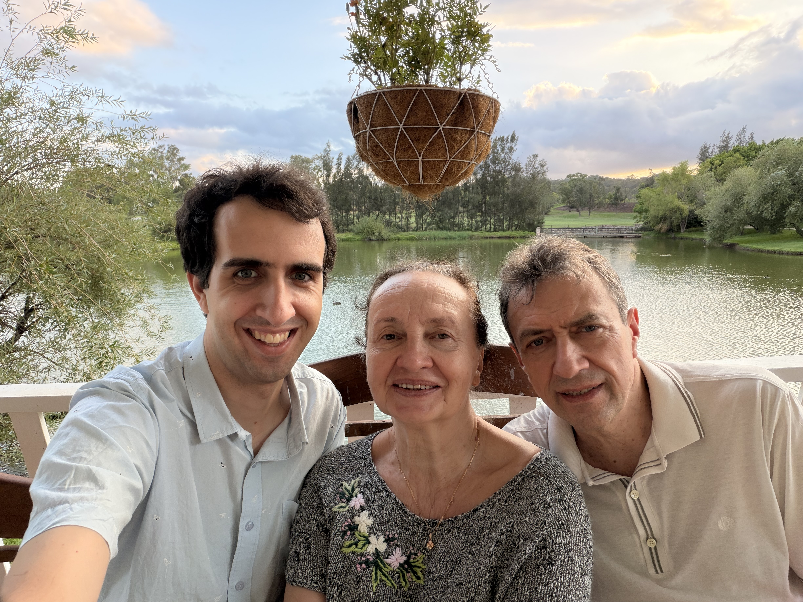

A few years ago my parents helped me and Koto buy our first home - a 2 bedroom apartment in Artarmon, Sydney. I knew I had to thank them for this somehow, and the perfect opportunity appeared this year: our baby. With us planning to give birth in Japan, our apartment in Sydney would be empty for a whole 6 months. And from that a great idea came about: how about my parents live in the apartment for 3 months, before they come visit us and our then born baby in Japan.

This was the first piece of me expressing my gratitude and doing oyakoukou. I got to spend 1 month living together with my parents again, shopping with them, cooking with them, playing games and traveling a bit. And then when I left they got to really experience life in Sydney in summer with all our delicious fruit, fresh meat and fish and gorgeous warm weather.

They said that it was an amazing experience for them, and especially dad didn’t want to leave the fruit paradise.

## Traveling Japan

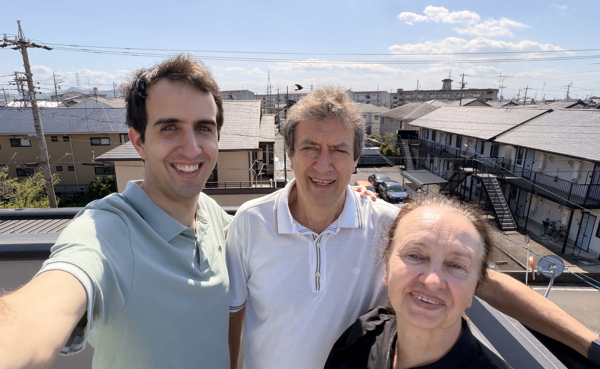

A month after our baby boy was born, my parents came to Japan to meet him. But they didn’t want to just visit for 1 day, so I set them up with a 10 day itinerary.

It includes a trip to Yamaguichi, Fukuoka, Kuranshiki and Okayama cities, as well as 2 trips to Kotone’s childhood home.

## Meeting the grandchild and in-laws

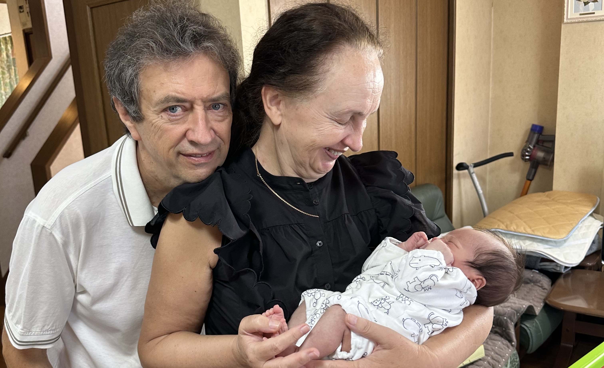

The main purpose of the trip to Japan was for my parents to meet and spend time with their first grandchild and the heir to the Brodsky name. And to see Kotone’s family again, who they haven’t seen since our wedding 3 years ago.

By visiting Kotone’s childhood home, they got to both meet and talk to Kotos family and to spend time with their grandchild.

Of course him being still 1 month old it was a very nostalgic feeling. 30 years ago they held me in their hands, and now they are holding my child.

It was such a warm feeling, seeing my mom become a grandma and my dad become a grandpa.

## Yamaguchi - Yudaonsen

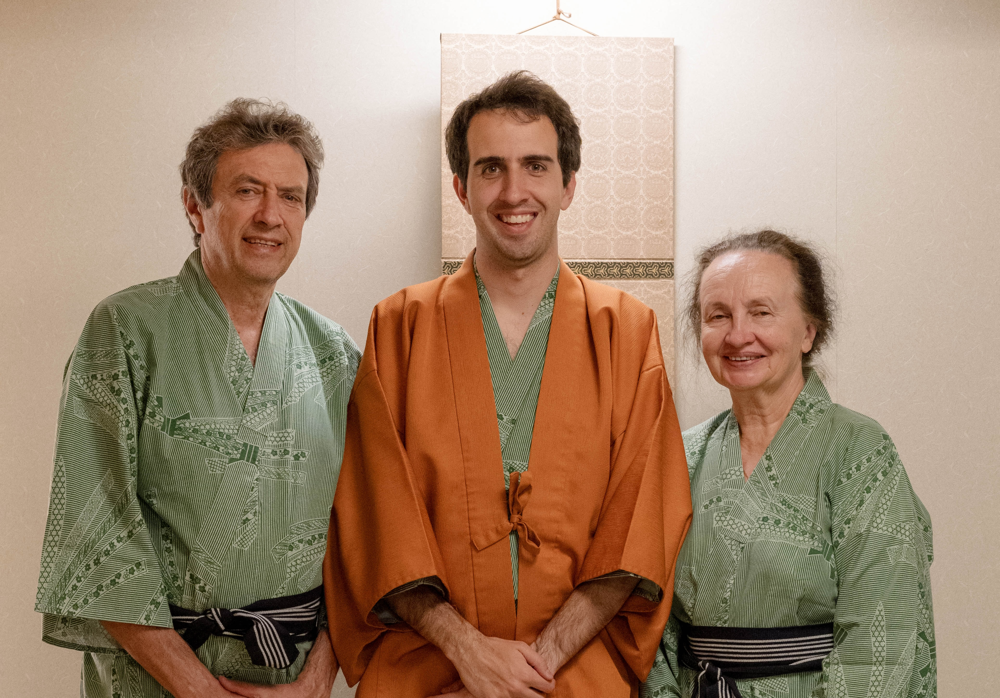

A trip to Japan is not complete without a dip in an onsen. But this time we started with the onsen.

Yamaguchi is a very quiet prefecture, and honestly the area around Yudaonsen was a bit run down. But the hotel we stayed at ([Mastsumasa](https://www.matsumasa.jp)) and their onsen (both indoor and outdoor) were amazing.
I can never get tired of Japanese hot springs, and neither can my parents, they are happy to go every day.

Near our hotel there were many bars and izakaya but barely anything open for lunch. So we had no choice but to go to Gusto - which ended up being my parents first family restaurant experience. And they loved it.

## Fukuoka

### Umi no Nakamichi Park

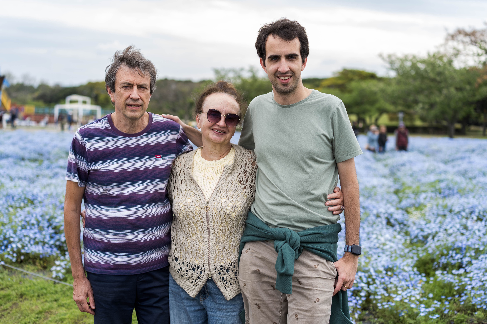

The first day in Fukuoka we spent in the large flower garden - [Umi no Nakamichi](https://uminaka-park.jp). They had beautiful flower displays there, but because it was all spread across a large area we had to walk for over 10km total. They also had a small zoo there with a few exotic animals, which was fun to see.
For dinner that night we bought a huge sushi platter for only 4600¥ from Lopia. [It was delicious and such a good deal!](https://www.reddit.com/r/sushi/comments/1mjvdlv/if_youre_in_fukuoka_go_to_lopia_fresh_and/) Highly recommend.

### Dazaifu Tenmangu Shrine

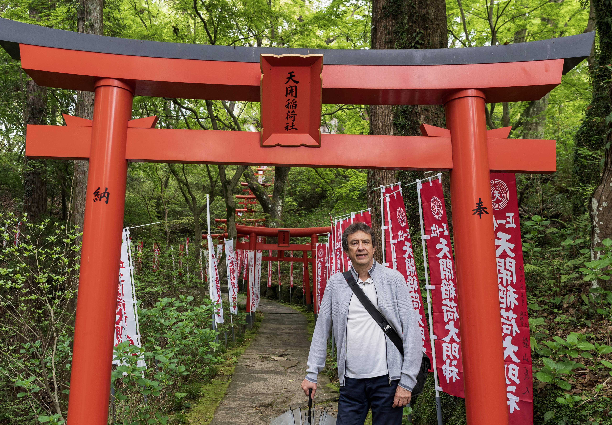

In the morning of the second day we went to the [Dazaifu Tenmangu](https://www.dazaifutenmangu.or.jp/en/) shrine. Unfortunately it was raining quite heavily and so we had to walk around with umbrellas all day. And the shrine itself was closed for renovations. Still cool to see it all, but not as pleasant of an experience as it could have been. But it’s ok, because this wasn’t the main purpose of the trip, it was actually what we had planned for the afternoon.

### The Lexus factory

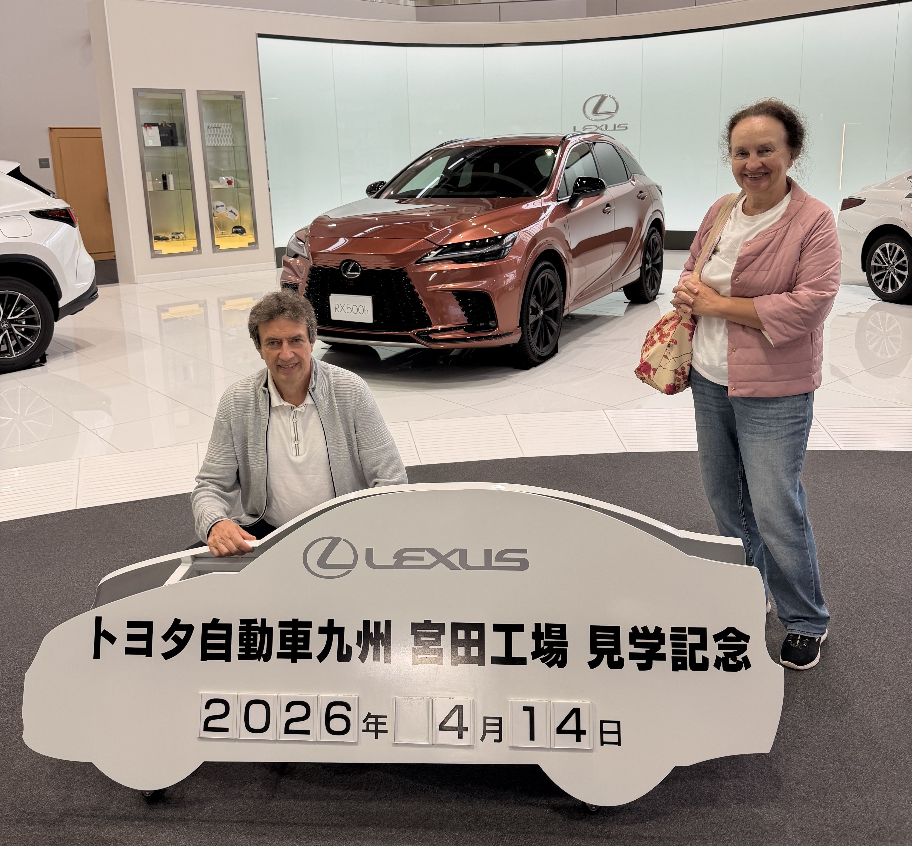

My dad has loved Lexus cars for the past 20 years and it has been his dream to see them being built in the factory live. And I wanted to fulfil his dream so I booked us [a tour in the Kyushu Toyota and Lexus factory](https://www.toyota-kyushu.com/plant_tour/).
In the factory we were taken inside the welding and assembly halls of the main factory. My dad was seriously impressed by the robots that were performing all the tasks and the craftsmanship that went into the build of the cars.

There were also interactive displays where you could compete in painting, gathering bolts, plugging holes and comparing colors to workers of the factory. Both me and my dad tried but our skills could not compare to those of masters in the factory.

Obviously there were no photos allowed in the factory itself, so we can't share the experience we had. You will have to go there and check it out yourself. (It is completely free!)

And then to top of the day we had some delicious Hakata tempura and went to the onsen in the hotel.

## Denim in Kurashiki

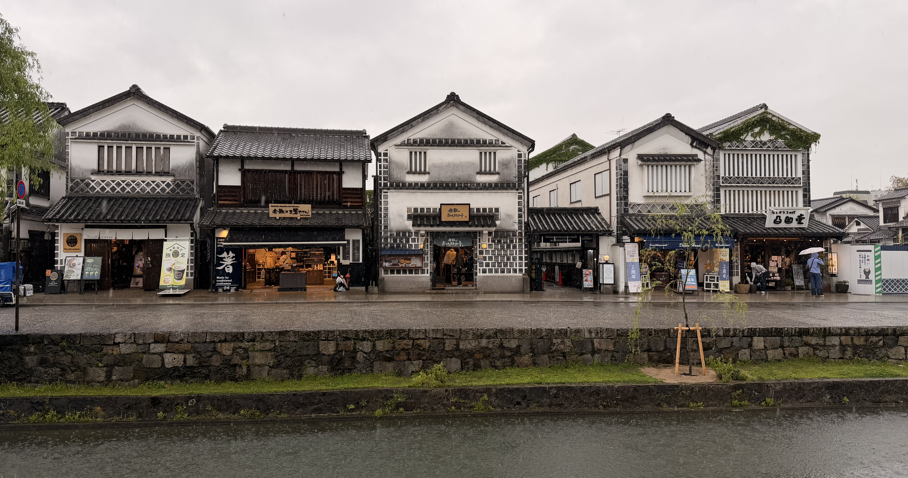

The next day the rain got even worse, but we had to continue our trip to Kurashiki. My mom learned about this place and really wanted to visit it, so I made sure we could stop by on our way back to Nagoya.

Kurashiki is a small and quaint town, with gorgeous old Meiji era buildings on a canal in the center of the city. Not only that but it is also famous for its jeans and denim. So I knew I had to buy a pair!

With the rain cleaning in the evening, I got to take so gorgeous night shots of the town, so for me this also turned into a bit of a photography trip.

## Okayama

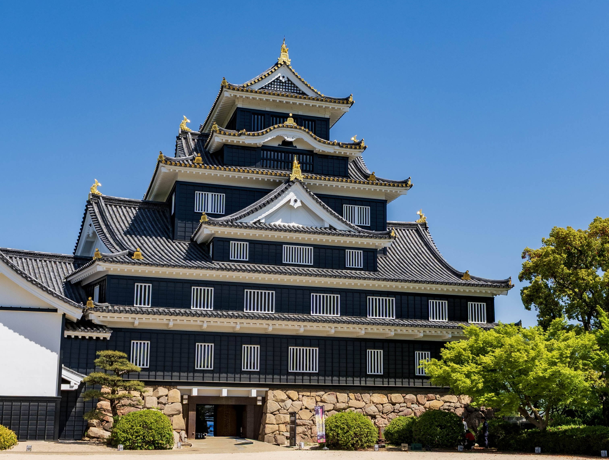

Next day was completely sunny, a perfect day for us to explore Okayama Castle and the garden near it.

Okayama castle is beautiful and had a great view from the top. And the Japanese garden was definitely worth the visit.

## Nagashima and Nabana

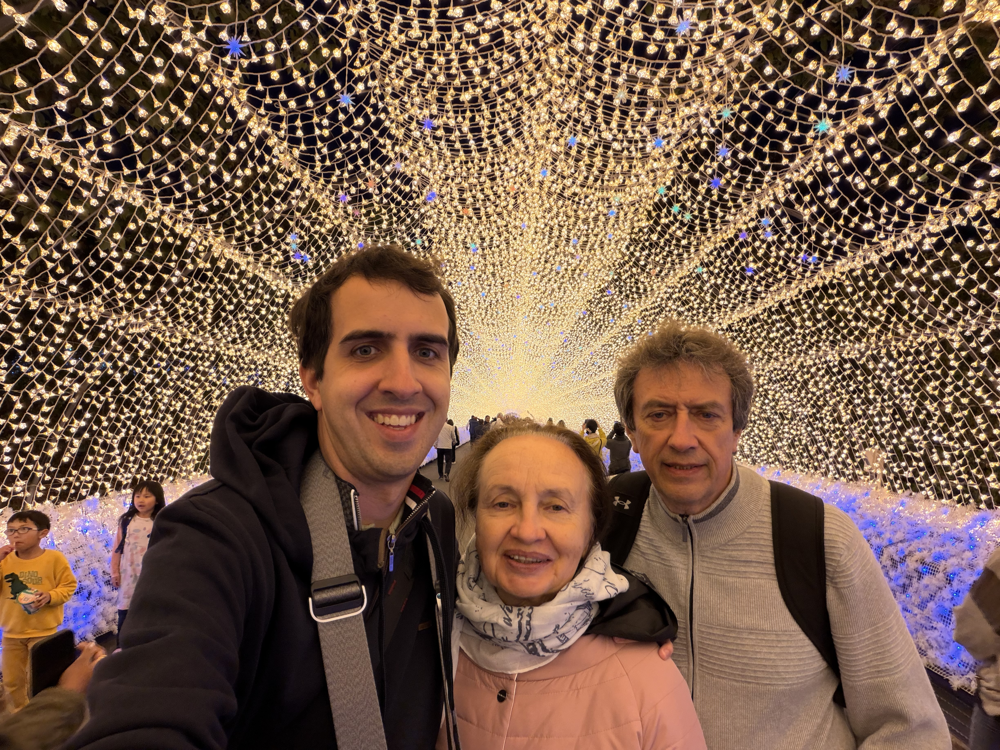

Now that we’re back in Nagoya, we had 1 more thing we wanted to do - shop for some clothes at an outlet. So we went to Nagashima Outlet and spent most of the day shooing there.

But on the way back we stopped by the flower garden [Nabana no Sato](https://www.nagashima-onsen.co.jp/nabana/index.html). This garden was surprisingly even more beautiful than the large flower park in Fukuoka.
And not only did it have more flowers, it also had a night illumination show.
This once again tuned into a photography trip for me, as opposed to my parents who were admiring the gorgeous flowers.

## At the Kamino home again

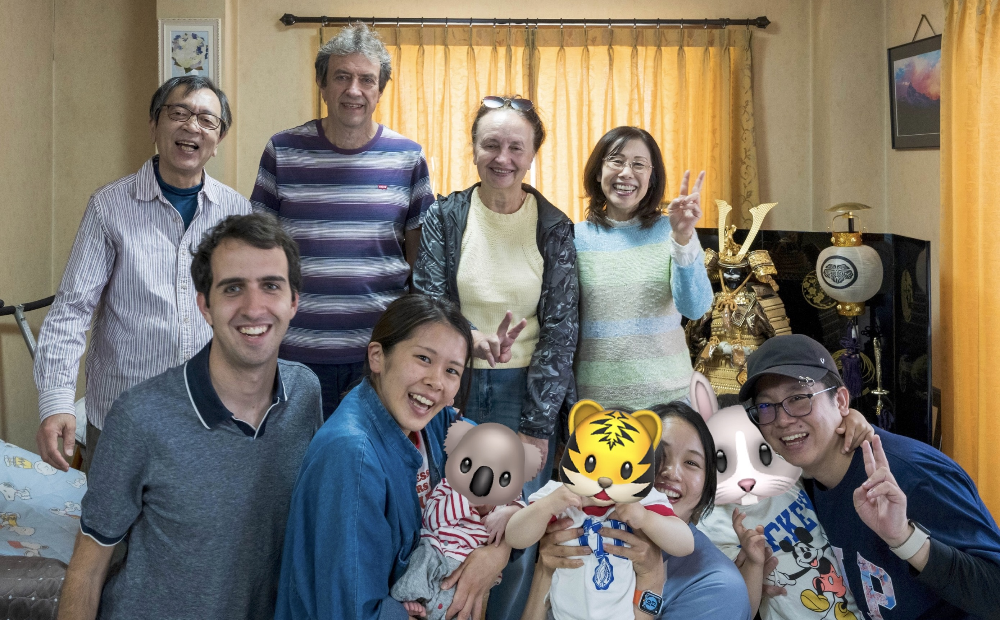

One more day of meeting the in-laws and spending time with the grandchild.
It is always so nice seeing both families gather together - the Kamino and Brodsky families fates are connected.

I hope that we can one day again meet up like this somewhere in this world.

## Time to head home

For my parents, their long journey has ended and they are now on a flight back yo Riga (via Hong Kong and Amsterdam). But for me, I will be staying in Japan with Koto and our boy till the end of July and then we will return to our home in Sydney.

Over these past few months I got to spend a lot of time with my parents and cherished every moment of it.

We took a lot of photos during the trip and you can see them on my [Flickr](https://www.flickr.com/photos/jamiejakov/albums/72177720333193816).

Well that’s it, that was my Oyakoukou.
