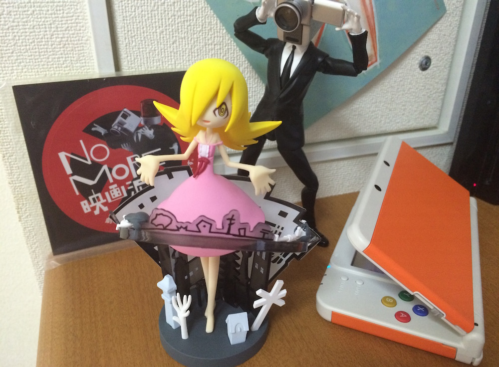

Meet [Moffle](http://anilist.co/character/88506/Moffle-), the mascot of JamieJakov Brilliant park... I mean my new NEW 3DS. He will serve me well in all matters related to playing Nintendo games, such as Pokemon, Pokemon, Pokemon and Pokemon (SSB and Project Mirai as well). And since it is a Japanese version, everything will be in Japanese, thus forcing me to not forget the language.

How did I get my hands on this gorgeous peace of technology, you might ask. It was a gift of love from the one and only [AmeH](http://twitter.com/dekopatchi)! It was our [one year anniversary](http://jamiejakov.lv/life/one-year-anniversary/ "Happy 1 year anniversary, my darling.") last month and to remember it, we gave each other a present. Well, technically I got three ^\_^

I also welcome the third Shinobu to my shelf of figures, and of course the award for most amazing figure I own now goes to Eiga Dorobou. He will always be there in the corner, recording all of my other figures (#nohentai).

Thank you dear, hope you enjoy using your new toy too ;)
