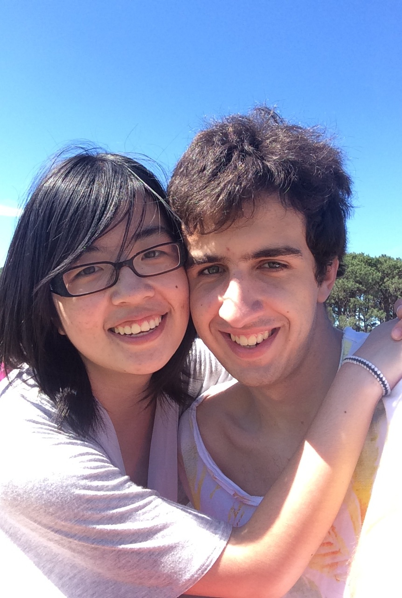

If you're happy and you know it, write a post!

It is amazing how fast this year went by, and its not just because I am living and "studying" in Japan. I've have been together with this great girl you see on your left for exactly a year now, which is exactly 365 days more than if we weren't dating. Coincidence? I think not!

Sometime in September 2013, after exiting a sour relationship, I thought I would just relax until Japan, focus on my studies and work, live my life without a care in the world. But something happened, a girl from my Japanese class who used to only talk to me about Free! suddenly invited me to listen to her presentation because it was on the topic of magical girls, and she figured an otaku like me would like to hear it. I was free at the time, so I decided: "whyyyyy not?". It was a good presentation, she got a good mark, but thats not the point. I guess after coming out of a relationship where the other side didn't accept your interest, there was suddenly this person who enjoy similar, if not the same, things as you, it lit a spark somewhere in me. Not only was she into anime, but she had a sense of style, a sense of taste in things, heck she studies visual communications (design). I was interested.

It wasn't long before we went for dinner together (no literarily it was that evening after the presentation). We had lunches together, karaoke, and just talked in class and on twitter. We even flirted using emoji on twitter. Then the time came for the exam and VC weeks, so I would not be able to see her or talk to her much. I didn't want that, so I decided to invite her to watch a movie on the holidays, the first monday of the holidays, September 23rd. You can probably see where this is going.

First date, confession, second date, third date, ......, one year together, ->>>>>>>

She was shy; I was a nerd; And now we are together.

I'm sure we will continue our amazing relationship and win the best couple award (made by Seb). She is my best girl, and I am her best girl ♡.

Happy anniversary Amy!
