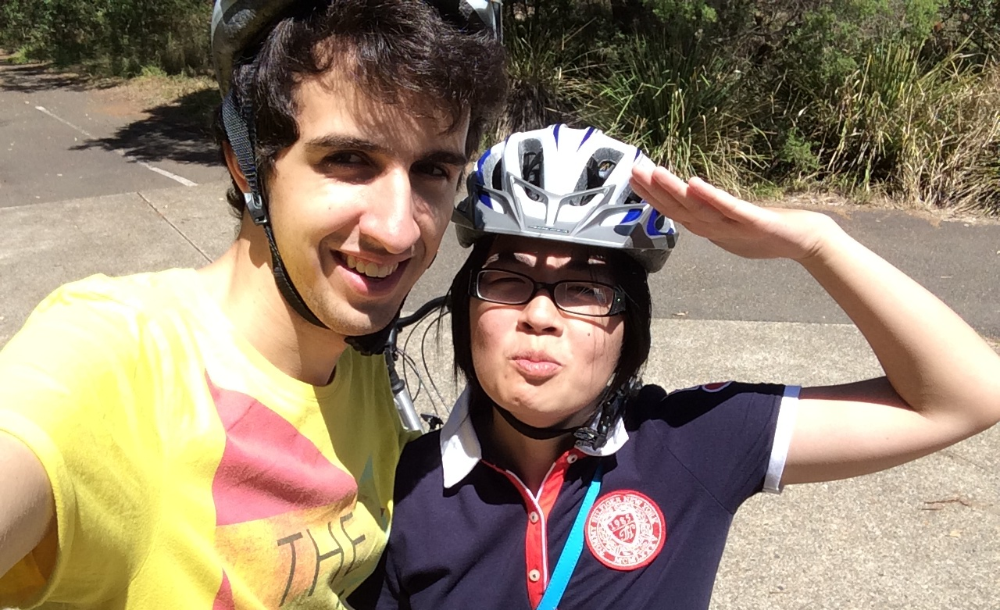

If you want to enjoy living in japan for more then just a few weeks, then you need a bicycle. Bikes are the most popular way of transport in Japan and definitely the most convenient, especially for both Amy and me. Amy will be going to Saga and I will be going to Kagoshima for our In Country Study (ICS) this year. Both of these cities aren't giant metropolises like Tokyo or Osaka, their population doesn't even reach a million. So while living in the countryside (as we like to put it), it is essential for us to know how to ride a bike.

And that is exactly what we did. We went cycling! In Bicentennial park (next to Olympic Park) they offer bike hire for $20 per 2 hours, which is a rather good deal for Sydney, I'd say. It was a great afternoon, we had a lot of fun riding around the park. Would recommend to all my friends!
